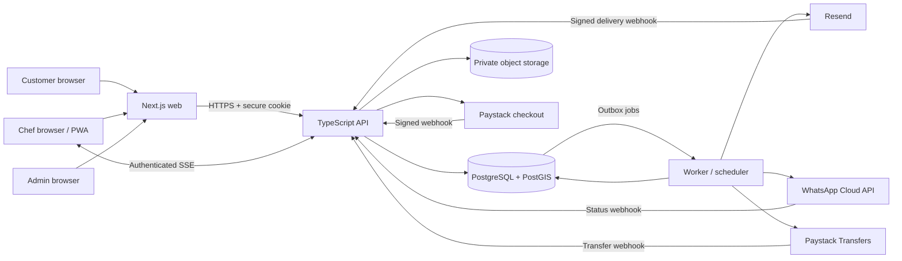
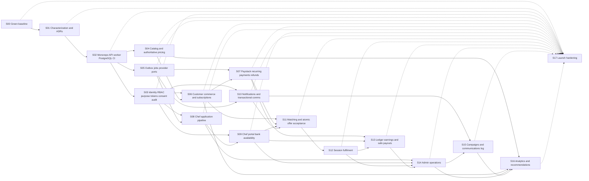

# Chefmate Three-Sided Platform Execution Blueprint

| Field | Value |
|---|---|
| Plan ID | `CHEFMATE-PLATFORM-001` |
| Repository baseline | `88f1aad` (`feat: expand booking flow and pricing plans`) |
| Baseline branch | `main`, synchronized with `origin/main` on 2026-07-28 |
| Plan status | Reviewed and ready for execution; implementation not started |
| Business timezone | `Africa/Johannesburg` |
| Currency | ZAR, stored as integer cents |
| Progress ledger | [chefmate-platform-progress.md](./chefmate-platform-progress.md) |

## 1. Outcome

Build Chefmate into a secure, auditable, three-sided platform in which:

1. Customers buy one of exactly four pricing plans, book sessions, choose meals, pay, track fulfilment, manage subscriptions, and reorder without any individual main-meal price.
2. Approved chefs activate a portal through a single-use magic link, complete their profile and bank details, set availability and service areas, receive job offers, see the exact Rand amount offered, accept or decline work, complete sessions, and track earnings and payouts.
3. Admins manage customers, chefs, applications, interviews, invitations, bookings, payments, revenue allocation, payouts, catalogs, campaigns, communications logs, support issues, and growth analytics.
4. Pricing, allocation, payment, booking, acceptance, refund, and payout actions are enforced by the server and recorded in an immutable audit trail.
5. Chef-facing screens, APIs, emails, WhatsApps, notifications, downloads, and exports never disclose a percentage, a platform share, or percentage language. They show Rand values only.

The implementation is complete only when the end-to-end acceptance matrix in section 19 passes in CI and a production-like staging environment.

## 2. Current-state assessment

The assessment was performed against clean commit `88f1aad`.

| Area | Evidence | Finding |
|---|---|---|
| Application | `package.json:17-43`, `tsconfig.json:3-18` | Single Next.js 15 / React 19 / strict TypeScript frontend. |
| Routes | `src/app/page.tsx`, `src/app/login/page.tsx`, `src/app/survey/[token]/page.tsx` | Only `/`, `/login`, and `/survey/[token]` exist. |
| Backend | Repository-wide route/schema inspection | No product API source, route handlers, ORM, SQL, migrations, worker, queue, or database. |
| API boundary | `src/lib/env.ts:16-48` | The browser expects a separate service at `NEXT_PUBLIC_CHEFMATE_API_URL`, locally `http://localhost:3001`. |
| Existing API contracts | `src/features/auth/api/authClient.ts`, `src/features/order-flow/api/*`, `src/features/survey/SurveyPage.tsx` | Browser clients assume auth, catalog, availability, quote, booking-request, and survey endpoints. |
| Identity | `src/features/auth/api/authClient.ts:5-13` | Response parsing knows `CUSTOMER`, `COOK`, `ADMIN`, `SUPPORT`, but there is no authorization or role routing. |
| Persistence | `data/meals.json`, client reducers | Catalog data is static and an in-progress order is client memory only. |
| Pricing | `src/features/plans/planCatalog.ts:1-61`, `src/features/order-flow/constants/menu.ts` | The fourth plan is `full-house`; mains, sides, and desserts carry individual prices. |
| Side rule | `src/features/order-flow/state/orderReducer.ts:173-176` | Side selection is unlimited and has no two-included rule. |
| Checkout | `src/features/order-flow/api/bookingRequestClient.ts:39-62`, `src/features/order-flow/components/Confirmation.tsx:81-104` | Checkout creates a request and displays offline bank-transfer instructions; no payment gateway or reconciliation exists. |
| Availability | `src/features/order-flow/api/availabilityClient.ts`, `src/features/order-flow/components/ScheduleSelect.tsx:79-116` | Slots are not linked to chefs, duration, capacity, bookings, or service areas; API failure can fall back to local slots. |
| Fulfilment | `src/features/order-flow/api/bookingRequestClient.ts:9-17` | Status names exist, but no status-reading UI/API, matching, offer, assignment, or session workflow exists. |
| Popular meals | `src/features/order-flow/constants/menu.ts:371-377` | “In demand” is a hard-coded list, not an analytical result. |
| Operations | Repository inspection | No CI workflow, deployment/IaC, `.env.example`, monitoring, migration gate, or security pipeline. |

### 2.1 Verified baseline

- `pnpm lint`: passed with one non-blocking `react-hooks/exhaustive-deps` warning in `src/features/survey/SurveyPage.tsx:126`.
- `pnpm test`: 40 files and 205 tests passed.
- `pnpm test:coverage`: passed; 88.15% statements, 81.91% branches, 82% functions, and 88.15% lines.
- `pnpm build`: passed.
- `pnpm test:e2e`: 10/14 test executions passed across 2 Playwright projects. The four failures are two duplicated regressions:
  - the tablet CTA center-point hit test fails in Chromium and Mobile Safari;
  - the order-flow test expects the old “Find what you want to eat.” meal step immediately after clicking “Book a chef” in Chromium and Mobile Safari.

Step `S00` must make the E2E baseline green before new platform work starts.

### 2.2 Foundations to preserve

- Strict TypeScript and `noUncheckedIndexedAccess`.
- Zod validation at browser/API boundaries.
- Server-authoritative quote calls.
- Integer-cent response values.
- Credentialed session calls.
- Idempotency keys on booking submission.
- The tokenized survey route and its customer/chef question model.
- The current external API boundary; the missing API will be implemented behind it.

## 3. Locked implementation assumptions and decision register

These defaults make the plan executable without waiting for another discovery cycle. A business owner may change a default through the mutation protocol in section 22 before the affected step starts.

| ID | Locked default | Why / required confirmation |
|---|---|---|
| `D001` Backend location | Create the missing backend in this repository as a modular monolith with separate web, API, and worker processes. | No backend source exists locally. If another backend repository exists, stop `S01`, inventory it, and mutate file ownership rather than building a duplicate. |
| `D002` Four plans | Canonical codes are `TONIGHT`, `RHYTHM`, `FAMILY`, `PREMIUM`. Seed current values as Tonight R527.85 / 1 session, Rhythm R1,999 / 4, Family R3,799 / 8, Premium R5,055 / 12. | Premium inherits the current `full-house` economics until the owner supplies a different price or entitlement. Keep `full-house` as a migration alias only. |
| `D003` Sides | The first two selected sides are included. Side 3 onward costs R55 each. Default total-side cap is six, configurable per price version. | The request says “max of 2 sides and then R55 extra for any other side”; this plan interprets that as two included, not a hard cap of two. |
| `D004` Dessert | Zero or one dessert may be selected; any selected dessert costs R90, regardless of dessert identity. | Supports the current one-dessert UI while enforcing the requested fixed price. |
| `D005` Main meals | A main selection never changes the quote. Main items have no price field in domain contracts or customer UI. | Direct user requirement. |
| `D006` Allocation | Internally, commissionable session value is allocated using 6,500 basis points to chef liability and the exact integer-cent remainder to the platform allocation. | The percentage is an internal accounting rule only. Chef projections expose amounts, never basis points or shares. |
| `D007` Discounts | Platform-funded discounts reduce the platform allocation first and do not lower the chef’s contracted offer. Discounts that would make the platform allocation negative require finance approval. | Protects the amount a chef accepts. An accountant may replace this policy before launch. |
| `D008` Fees and “profit” | Payment fees, refunds, taxes, support credits, and recorded direct costs are separate ledger lines. The admin UI labels 35% as “platform allocation,” not “actual profit.” “Net contribution” is platform allocation minus recorded costs. | A 35% allocation is not accounting profit by itself. Tax and revenue-recognition treatment require South African accounting review. |
| `D009` Subscriptions | A successful recurring plan invoice creates exactly one cycle of session credits. Package gross and package chef cents are each allocated once across deterministic credit ordinals; chef liability is earned only when a linked session completes. | Paystack South Africa recurring billing initially requires a reusable card authorization. EFT and other non-reusable once-off channels cannot create a subscription. |
| `D010` Payout timing | Chef earnings move to payable after session completion and a configurable hold. Initial cadence is weekly admin-approved batches. | Allows cancellation, dispute, and refund handling. |
| `D011` Customer payments | Use a `PaymentProvider` port with Paystack as the first adapter for ZAR checkout. Collect funds to the platform; do not split at checkout. Recurring subscriptions use reusable-card authorization only until another supported recurring channel is approved. | EFT remains available for eligible once-off ZAR checkout but cannot establish recurring billing. |
| `D012` Chef transfers | Use a `PayoutProvider` port with Paystack Transfers as the first adapter. Retain a dual-controlled manual bank-export fallback behind the same payout state machine. | Only the payout worker generates an encrypted, signed fallback file; access is one-time, short-lived, audited, restricted to a managed finance workstation, and followed by expiry/destruction attestation. |
| `D013` Email | Use a `MailProvider` port with Resend as the first adapter for transactional messages, contacts/segments, marketing broadcasts, and delivery webhooks. | The platform database remains the communication audit source of truth. |
| `D014` WhatsApp | Use a `MessagingProvider` port with Meta WhatsApp Cloud API as the first adapter. Only approved templates and consented recipients may receive proactive messages. | Provider business verification and template approval are an operational launch gate. |
| `D015` Realtime | Persistent database notifications plus authenticated Server-Sent Events, with short polling fallback. | Offers survive disconnects; SSE is sufficient for one-way job/session notifications. |
| `D016` Authentication | Opaque, hashed server sessions in secure `HttpOnly` cookies; Argon2id password hashes; hashed, single-use, expiring magic-link tokens. | Preserves credentialed browser calls while avoiding browser token storage. |
| `D017` Geography | Service areas are admin-managed PostGIS polygons. Exact address is field-protected and available only to the active assigned chef during the service-access window or to explicitly permitted, re-authenticated, audited operations/admin access. | Support stays masked except time-bound audited break-glass. Revoke access on cancellation/reassignment and after the post-service cutoff; exclude it from history, caches, analytics and exports. |
| `D018` Role naming | Migrate `COOK` to canonical `CHEF`; accept `COOK` only during a compatibility window. | Aligns code and product language. |
| `D019` Marketing consent | Transactional messages are separate from marketing consent. Marketing email and WhatsApp each have independent opt-in/out records, a send-time evaluator, suppression state, and inbound opt-out handling. | This core exists before transactional provider egress; campaign tooling extends rather than creates it. |
| `D020` Execution mode | Git is available; GitHub CLI is not. Each step is one reviewable branch/commit series, pushed with Git. PRs are opened manually in GitHub when required. | Do not make unrelated changes on `main`; do not assume `gh` commands exist. |

## 4. Non-negotiable invariants

### 4.1 Commerce

1. A sellable checkout references one active version of one of four canonical plans.
2. Catalog meal identity and price identity are separate. Main meals, side identities, and dessert identities have no per-item customer price.
3. The server calculates every quote. The browser may display but never authoritatively calculate or submit an amount.
4. The first two sides are included; `max(0, selected_side_count - 2) × 5,500` cents is charged for extras.
5. A selected dessert adds exactly 9,000 cents.
6. Quote, order, booking, entitlement, allocation, refund, and payout rows retain immutable price snapshots.
7. All monetary values are integer cents. Floating-point money is forbidden.
8. Every journal transaction balances by currency using one sign convention: debit cents are positive, credit cents are negative, and the signed sum is zero. Collection, completion, refund, chargeback, fee, payout, tax, and reversal each use their own approved journal template; no global gross equation substitutes for event-specific accounting.
9. VAT-inclusive display, tax point, commissionable value, revenue recognition and refund allocation remain gated by `G003` and `G004`. Refund provider egress is feature-disabled until both decisions plus installed/reconciled S13 posting and A26 pass; `A03` and `A13` cannot pass while their applicable gates/controls remain open.
10. A duplicate checkout, webhook, renewal, credit issuance, refund, offer acceptance, completion, payout, or transfer request cannot duplicate money or state.

### 4.2 Chef confidentiality

1. Chef DTOs may contain `offered_amount_cents`, `earned_amount_cents`, `paid_amount_cents`, and formatted Rand equivalents.
2. Chef DTOs must not contain allocation rates, basis points, platform amounts, gross customer totals, processor fees, or internal margin.
3. Chef templates and UI copy must not contain `%`, “percent,” “percentage,” “commission split,” “platform share,” or “65/35.”
4. The API, not CSS or UI hiding, enforces the projection.
5. Contract snapshot tests scan chef JSON, email, WhatsApp, exports, and page text for forbidden fields and words.

### 4.3 Security and privacy

1. Every protected endpoint authenticates, authorizes by role/scope, and applies subject ownership checks.
2. Admin mutation actions create redacted audit entries.
3. Raw bank account numbers are encrypted with envelope encryption and never logged, indexed, exported casually, or returned after initial submission.
4. Magic-link tokens are hashed at rest, single-use, purpose-bound, rate-limited, and expire. Invitation URLs put the token only in the fragment; GET/prefetch never consumes it, the no-third-party landing removes it immediately, and only an explicit POST consumes it.
5. Provider webhooks are signature-verified against the raw payload and deduplicated before processing.
6. Secrets remain server-only; `.env.local` and production secrets never enter Git.
7. Exact address is returned only to the active assigned chef during the service-access window and to explicitly permitted, recently re-authenticated, audited operations/admin actions. Support sees a mask unless time-bound break-glass is approved. Cancellation, reassignment and the post-service cutoff revoke access immediately; exact address is never cached, exported, placed in history/analytics, or sent with direct customer contact details.
8. Marketing sends honor channel consent and suppression at send time, not only when an audience is created.
9. Every protected application table has `ENABLE ROW LEVEL SECURITY` and `FORCE ROW LEVEL SECURITY`; runtime roles are non-owner, `NOSUPERUSER`, and `NOBYPASSRLS`, and tests connect as those exact production roles.
10. Bank-account changes require step-up authentication, risk evaluation, alerts to old and new verified channels, a payout cooling-off hold, audited approval when risk policy requires it, and session revocation on suspected takeover.

## 5. Target architecture

The target is a modular monolith: one domain model and database, separated into deployable processes rather than premature microservices.



### 5.1 Repository topology

```text
/
|-- apps/
|   |-- web/                 # Next.js role-aware application
|   |-- api/                 # Fastify HTTP API, auth, SSE, webhooks
|   `-- worker/              # outbox, schedules, offers, reminders, payouts
|-- packages/
|   |-- contracts/           # Zod contracts and OpenAPI generation
|   |-- domain/              # state machines, pricing and finance rules
|   |-- application/         # use cases and ports
|   |-- database/            # schema, migrations, seeds and repositories
|   |-- integrations/        # Paystack, Resend, Meta, storage and KMS adapters
|   |-- config/              # typed runtime configuration
|   |-- observability/       # logging, tracing, metrics and redaction
|   `-- testkit/             # factories, provider fakes and database helpers
|-- tests/                   # contract, integration, e2e, security and load
`-- plans/
```

Only `S02` moves the current frontend mechanically to `apps/web`; `S01` owns documentation and executable legacy fixtures only. Behaviour changes are prohibited in the move. Any root-web exception requires an approved section 22 mutation; the API, worker, and canonical package boundaries remain unchanged.

### 5.2 Runtime responsibilities

| Runtime | Owns | Must not own |
|---|---|---|
| Web | Rendering, accessible interactions, route guards, calling typed contracts, SSE client, local draft recovery | Pricing authority, role authorization, bank decryption, provider secrets |
| API | Validation, auth/RBAC, commands/queries, short transactions, webhook ingestion, SSE fan-out | Long provider calls inside DB transactions, scheduled campaigns, payout batch loops |
| Worker | Transactional outbox processing, retries, reminders, offer waves/expiry, aggregates, provider sends/transfers | Public browser endpoints |
| PostgreSQL | Source-of-truth state, constraints, immutable ledgers, audit, job/outbox leases | Raw card data or provider secret keys |
| Object storage | Private chef documents/profile media with signed access | Public bank data or unrestricted application files |

### 5.3 Reliability pattern

Any transaction that changes a business state and requires an external action writes both the state and an `outbox_events` row in one database transaction. The worker claims rows with `FOR UPDATE SKIP LOCKED`, sends through an idempotent provider adapter, records the provider result, and retries with bounded exponential backoff. Dead-lettered jobs surface in admin operations.

## 6. Pricing and allocation specification

### 6.1 Canonical formula

```text
extra_side_count       = max(0, selected_side_count - 2)
extra_side_total_cents = extra_side_count * 5_500
dessert_total_cents    = dessert_selected ? 9_000 : 0

session_value_cents =
  allocated_plan_session_value_cents
  + extra_side_total_cents
  + dessert_total_cents

chef_base_cents = allocated_plan_session_chef_cents

chef_extra_cents =
  round_half_up((extra_side_total_cents + dessert_total_cents) * 6_500 / 10_000)

chef_offer_cents = chef_base_cents + chef_extra_cents
platform_allocation_cents = session_value_cents - chef_offer_cents
```

`allocated_plan_session_value_cents` and `allocated_plan_session_chef_cents` are immutable values stored on the selected session credit or once-off compensation snapshot. A recurring credit's chef amount is never recalculated from that credit's gross amount. `round_half_up` uses integer arithmetic for package totals and add-ons; the platform receives each exact remainder.

### 6.2 Subscription credit allocation

For a plan version costing `P` cents with `N` sessions and allocation basis points `B = 6_500`:

1. Compute package chef cents once: `C = floor((P * B + 5_000) / 10_000)`; package platform cents are `P - C`.
2. Compute `gross_base = floor(P / N)` and `gross_remainder = P mod N`.
3. Compute `chef_base = floor(C / N)` and `chef_remainder = C mod N` independently.
4. For deterministic credit ordinal `i` from `1..N`, store `gross_i = gross_base + (i <= gross_remainder ? 1 : 0)` and `chef_i = chef_base + (i <= chef_remainder ? 1 : 0)`.
5. Store `platform_i = gross_i - chef_i`; never derive `chef_i` by re-rounding `gross_i`.
6. Assert `sum(gross_i)=P`, `sum(chef_i)=C`, and `sum(platform_i)=P-C` for every plan/version. Credit ordering is the immutable cycle ordinal, not insertion timing.
7. Reserve one credit for a booking, redeem it exactly once on completed service, and release/forfeit it only through the approved cancellation policy. The customer may owe only add-ons while the chef offer includes the stored credit chef cents.

### 6.3 Worked examples

| Scenario | Customer/session value | Chef-visible amount | Admin platform allocation |
|---|---:|---:|---:|
| Tonight, two sides, no dessert | R527.85 | R343.10 | R184.75 |
| Tonight, three sides, dessert | R672.85 | R437.35 | R235.50 |
| Rhythm package, four credits | R1,999.00 package; each gross credit R499.75 | Package R1,299.35; credit ordinals 1-3 R324.84 and ordinal 4 R324.83 | Package R699.65; credit ordinals 1-3 R174.91 and ordinal 4 R174.92 |
| Any plan session, fourth side only | plan session value + R110.00 | base chef amount + R71.50 | base platform amount + R38.50 |
| Any plan session, dessert only | plan session value + R90.00 | base chef amount + R58.50 | base platform amount + R31.50 |

Seeded vectors for Tonight, Rhythm, Family and Premium assert exact package/credit gross, chef and platform sums and deterministic ordinal ordering. Examples exclude tax, discounts, refunds, and provider fees; those use separate approved journals and never silently alter an accepted chef offer. `A03` and `A13` remain blocked until `G003` and `G004` resolve their accounting effects.

### 6.4 Quote line semantics

Customer/admin quote lines:

- `PLAN_BASE` or `ENTITLEMENT_APPLIED`
- `INCLUDED_SIDES` with quantity `0..2` and zero charge
- `EXTRA_SIDE` with quantity `0..4` by default and unit price `5,500`
- `DESSERT` with quantity `0..1` and unit price `9,000`
- `DISCOUNT`
- `TAX` when tax treatment is approved
- `TOTAL`

Chef offer projection:

```json
{
  "offer_id": "uuid",
  "booking_reference": "CM-2026-000123",
  "scheduled_start": "2026-08-03T15:00:00.000Z",
  "scheduled_end": "2026-08-03T18:00:00.000Z",
  "service_area": "Sandton",
  "meal_name": "Roast Chicken Seven Colours",
  "side_names": ["Creamed Spinach", "Mielies", "Coleslaw"],
  "dessert_name": "Malva Pudding",
  "offered_amount_cents": 43735,
  "offered_amount_display": "R437.35",
  "expires_at": "2026-08-01T10:05:00.000Z"
}
```

No chef endpoint reuses the admin finance DTO.

### 6.5 Event-specific journal and policy gates

The ledger stores debit cents as positive and credit cents as negative; every transaction's signed entries sum to zero per currency. Journal templates are versioned and idempotent by source event:

| Event | Balanced journal rule |
|---|---|
| Captured collection | Debit provider clearing for captured cents; credit customer deferred revenue and, only as approved by `G003`, VAT payable. Processor fees post separately as debit fee expense/credit clearing. |
| Completed service | Debit the applicable deferred-revenue amount; credit chef payable for stored session/add-on chef cents and credit platform service revenue for the approved tax-exclusive remainder. VAT timing/base follows `G003`, never an implicit allocation formula. |
| Platform-funded discount | Debit discount contra-revenue and credit the customer/order balance under `G004`; it cannot reduce an already contracted chef amount without an approved policy and corrective event. |
| Refund or chargeback | Use a source-linked reversal/contra journal for the original deferred/recognized revenue, VAT, chef liability and platform allocation according to `G003`/`G004`; never infer allocation from a global gross equation. |
| Chef payout | Debit chef payable and credit provider clearing/bank. Transfer fees post separately and follow `G006`. |
| Correction | Reverse the original transaction in full or post an explicitly linked corrective journal; never update/delete posted entries. |

Refund initiation remains feature-disabled until `G004` is approved, the corresponding `G003` VAT journal is signed off, and S13/A26 proves installed zero-difference posting/replay. Test fixtures may model proposed policies but cannot mark `A03` or `A13` passed while an applicable gate/control is open.

## 7. Product state machines

### 7.1 Chef application

```text
APPLIED
  -> SCREENING
  -> INTERVIEW_SCHEDULED
  -> INTERVIEW_CONDUCTED
  -> APPROVED
  -> INVITED
  -> PORTAL_ACTIVATED
  -> ONBOARDING_COMPLETE
  -> ACTIVE
```

Terminal/side states: `REJECTED`, `WITHDRAWN`, `NO_SHOW`, `SUSPENDED`. Every transition records actor, reason, source status, destination status, and timestamp. Interview dates live in interview rows, not overwritten application columns.

### 7.2 Purchase and subscription

```text
Order: DRAFT_QUOTE -> CHECKOUT_PENDING -> PAYMENT_PENDING -> PAID -> FULFILLED
Subscription: PENDING_ACTIVATION -> ACTIVE -> PAST_DUE -> ACTIVE
                                      -> PAUSED
                                      -> CANCELLATION_PENDING -> CANCELLED
Invoice: CREATED -> PAYMENT_PENDING -> PAID -> CYCLE_ISSUED
                                   -> FAILED -> MANUAL_RETRY_PENDING
```

Only a verified reusable Paystack card authorization may activate recurring billing. EFT and any non-reusable authorization create once-off orders only. A unique provider invoice/renewal reference plus subscription period makes payment processing and cycle/credit issuance exactly once. Chefmate does not automatically retry a failed Paystack renewal: it records `PAST_DUE`, sends policy-approved dunning, and permits a customer-initiated manual retry/update flow. Local cancellation and provider cancellation are reconciled until both agree. Browser callbacks never mark paid.

Refund attempts preserve Paystack's lifecycle without collapsing provider facts: provider `pending` maps to internal `PENDING`, `processing` to `PROCESSING`, `needs-attention` to `NEEDS_ATTENTION`, `failed` to `FAILED`, and `processed` to `SUCCEEDED`. Internal `UNKNOWN` means transport/submission ambiguity only and is never used as a provider-status alias. Refund capacity remains reserved independently for `PENDING`, `PROCESSING`, `NEEDS_ATTENTION`, and `UNKNOWN`, is consumed by `SUCCEEDED`, and is released only by authoritative `FAILED` evidence.

V1 does not collect alternate customer bank details. `NEEDS_ATTENTION` is quarantined to permissioned, audited operations and Paystack escalation; no browser/API flow may blindly retry it, provide a new instrument, or create another attempt. `UNKNOWN` must be verified by the same provider reference before any retry decision.

### 7.3 Booking fulfilment

```text
Booking:
DRAFT -> HELD -> READY_TO_DISPATCH -> OFFERING -> CHEF_ASSIGNED
  -> CUSTOMER_CONFIRMED -> EN_ROUTE -> CHECKED_IN -> IN_PROGRESS
  -> COMPLETED -> CLOSED
```

Exact side/terminal booking statuses are `NEEDS_ADMIN`, `RESCHEDULE_REQUESTED`, `CANCELLED`, `NO_SHOW`, and `DISPUTED`; none is combined with a funding state. `READY_TO_DISPATCH` requires one valid funding branch:

```text
Payment funding: UNFUNDED -> PAYMENT_PENDING -> PAYMENT_CAPTURED
                                      -> PAYMENT_FAILED | PAYMENT_EXPIRED
                 PAYMENT_CAPTURED -> PARTIALLY_REFUNDED -> REFUNDED
                                  -> CHARGEBACK_PENDING -> CHARGEDBACK

Credit funding:  UNFUNDED -> CREDIT_RESERVED -> CREDIT_REDEEMED
                                          -> CREDIT_RELEASED | CREDIT_FORFEITED
```

Exactly one funding method applies. `PAYMENT_CAPTURED` or `CREDIT_RESERVED` permits dispatch; a credit is redeemed once on completed service. Database checks, transition maps, API enums, fixtures and projections use these exact names and reject the former slash-combined state.

### 7.4 Job offer

```text
PENDING -> ACCEPTED
        -> DECLINED
        -> EXPIRED
        -> WITHDRAWN
```

Acceptance is one database transaction:

1. Lock the booking row.
2. Verify the offer is pending, unexpired, and belongs to the authenticated chef.
3. Verify the chef is active, available, qualified, in-area, and not double-booked.
4. Insert the unique active assignment.
5. Mark the accepted offer and withdraw competing offers.
6. Move the booking to `CHEF_ASSIGNED`.
7. Insert notifications/outbox rows.
8. Commit, then return the accepted job projection.

Losing concurrent requests receive `409 OFFER_ALREADY_CLAIMED`; no partial assignment remains.

### 7.5 Earnings and payout

```text
PROJECTED -> ACCEPTED -> EARNED_PENDING_HOLD -> PAYABLE
  -> BATCHED -> PROCESSING -> PAID
```

Adjustment states are represented by immutable reversal/adjustment ledger entries, never by editing prior money rows. Transfer events persist raw provider facts separately from derived internal attempt state. `CREATED` and `SUBMITTED` are pre-provider internal states only. The following mapping is normative:

| Provider/raw fact | Internal state | Conclusive? | Reservation/payable effect | Allowed action/reference rule |
|---|---|---|---|---|
| No provider result / transport ambiguity | `SUBMISSION_UNKNOWN` | No | Keep the payout amount reserved. | Verify using the same reference; no replacement reference. |
| `pending` | `PROCESSING` | No | Keep the payout amount reserved. | Wait or verify using the same reference. |
| `otp` | `PROCESSING` | No | Keep the payout amount reserved. | Complete approval using the same reference. |
| `received` | `PROCESSING` | No | Keep the payout amount reserved. | Approve or wait using the same reference. |
| `success` | `PAID` | Yes | Clear the reserved payable amount to paid settlement. | No retry; a later authoritative `reversed` fact is handled as a correction. |
| `failed`, `abandoned`, `blocked`, or `rejected` | `FAILED` | Yes | Restore/release the reserved amount to payable only after authoritative reconciliation. | A new reference is allowed only after reconciliation and approval. |
| `reversed` | `REVERSED` | Yes | Post a linked reversal restoring chef payable and provider clearing. | A new reference is allowed only after reconciliation and approval. |

Raw provider facts are immutable and an exact duplicate is an idempotent no-op. `success -> reversed` is a permitted correction; any other contradictory terminal evidence enters `SETTLEMENT_CONFLICT` and freezes the affected payout scope. The payout/chef aggregate may enter `OVERPAID_RECONCILIATION`.

If an old reference succeeds before a replacement is submitted, cancel the replacement. If it succeeds after replacement submission, freeze that payout and the chef's future payouts, enter `OVERPAID_RECONCILIATION`, reconcile both transfers, and post approved corrective journals. No contradictory or stale fact may be discarded or silently overwrite history.

### 7.6 Communications

```text
PLANNED -> QUEUED -> SENT -> DELIVERED
                    -> BOUNCED/FAILED/SUPPRESSED
                    -> OPENED/CLICKED/READ
```

Provider events append delivery facts. They never overwrite consent history or erase the original send record.

## 8. PostgreSQL schema blueprint

PostgreSQL 16 or later is the system of record. The schema lives in `packages/database`, uses checked-in forward migrations, and is tested against real PostgreSQL. Application code never creates tables at runtime.

### 8.1 Database conventions and trust boundaries

- Enable `citext`, `pgcrypto`, `btree_gist`, and PostGIS. Match service areas with PostGIS geography, not free-form suburb strings.
- Separate `app`, `private`, and `analytics` schemas; revoke `PUBLIC`; grant distinct migration-owner, API, notification-worker, payout-worker, analytics and break-glass roles. Every protected table migration issues both `ENABLE ROW LEVEL SECURITY` and `FORCE ROW LEVEL SECURITY`. Runtime roles are non-owner with `NOSUPERUSER NOBYPASSRLS` and tests connect as those exact roles.
- Use `bigint GENERATED ALWAYS AS IDENTITY` internally and application-generated UUIDv7 `public_id` values at HTTP boundaries.
- Use `timestamptz` in UTC and render/group business reports in `Africa/Johannesburg`.
- Store money as signed/non-negative `bigint` cents, as appropriate, with currency constrained to `ZAR`. Floating-point money is forbidden.
- Index every foreign key. Use partial active-row indexes and keyset cursor indexes ending in time plus ID. Partition large events monthly and use BRIN time indexes where useful.
- Financial, snapshot, event, webhook, audit, and history rows use `ON DELETE RESTRICT`. Erasure uses tombstoning/anonymization, never cascaded deletion of accounting evidence.
- Effective-dated records use half-open ranges. Exclusion constraints prevent overlapping active plan, policy, bank-account, and assignment ranges.
- Status constraints mirror the exact booking, funding, renewal, refund and transfer states in section 7. One transition service owns each state change; arbitrary repository status updates are prohibited.
- Sensitive commands carry actor, correlation, source, and time. Mutable operational rows carry integer `version` for optimistic concurrency.

### 8.2 Identity, recruitment, and onboarding tables

| Table family | Critical fields, constraints, and indexes |
|---|---|
| `app_users`, `auth_credentials`, `auth_sessions` | UUIDv7 public ID, `citext` email, E.164 phone, status/auth-version, Argon2id hash, opaque-token hash, CSRF hash, issued/idle/absolute expiry/revocation facts. Unique active email/phone and token hash; active session indexes. |
| `purpose_tokens` | Generic purpose, subject, one-way token hash, issued/expiry/consumed/revoked facts and attempt counters. S03 owns this primitive only; no chef application foreign key or invitation issuance lives here. |
| `user_roles`, `role_permissions`, `user_permission_overrides` | Canonical roles `CUSTOMER`, `CHEF`, `ADMIN`, `SUPPORT`, `FINANCE`; grantor/effective/revoked facts. Unique active user/role; deny wins; `COOK` is compatibility input only. |
| `customer_profiles`, `customer_addresses` | User, profile preferences, address fields, PostGIS point, default/archive state. One default active address; customer and GiST geography indexes. Booking uses an immutable address snapshot. |
| `api_idempotency_keys` | Actor, route scope, key, request hash, state, response reference, expiry. Unique actor/scope/key; reuse with another hash returns `409`. |
| `admin_audit_events` | Actor, permission, action, entity, redacted before/after, request/correlation IDs, IP hash, time. Append-only entity/actor indexes; never bank plaintext, tokens, secrets, or raw provider payloads. |
| `consent_events`, `communication_suppressions`, `inbound_opt_out_events` | Subject, channel, purpose, policy/source, grant/withdraw/suppression/receipt facts. S03 owns minimal append-only storage and send-time evaluator; S15 adds audiences/campaigns. |
| `chef_applications`, `chef_application_events` | Applicant identity, source, status, submitted date, reviewer, decisions, linked user, immutable transitions. Index `(status, submitted_at DESC, id)`, reviewer queue, and email; one open application per normalized email. |
| `chef_interviews`, `chef_interview_events` | Scheduled range/timezone, interviewer, mode, meeting reference, status, conducted time, outcome and immutable reschedule history. Completion requires `conducted_at`; cancellation/no-show requires reason. |
| `chef_portal_invitations` | S08-owned application/chef linkage to a generic purpose token, issued/expiry/consumed/revoked times, issuing admin and delivery message. One active invitation per application; atomic single use. |
| `chef_profiles`, `chef_onboarding_tasks`, `chef_documents` | Profile and operational status, private media/document keys, versioned checklist, review/retention facts. Required tasks gate `ACTIVE`; object URLs are private and signed. |
| `service_areas`, `chef_service_areas` | Admin polygon, city/province, chef primary/travel preference, priority and effective range. GiST polygon and area-to-chef indexes; unique active chef/area. |
| `chef_availability_rules`, `chef_availability_exceptions` | Weekly local windows with timezone/effective range plus dated available/unavailable ranges. Validate windows and index chef/time overlap. |

Browser availability is advisory. Acceptance rechecks active status, service area, rules, exceptions, assignments, and booking window in the assignment transaction.

### 8.3 Bank-account versions and encryption

`private.chef_bank_account_versions` creates a new immutable row on every change. It stores chef, normalized bank name/identifier, branch code, account type, last four, verification/effective/revoked times, HMAC fingerprint, encrypted account-holder name and account number, encrypted provider recipient token, wrapped per-row data-encryption key, KMS key ID, authenticated-ciphertext package, crypto version, change risk score/reasons, approval actor, and `payout_hold_until`. A partial unique index permits one effective version per chef; pending high-risk versions cannot become effective without maker approval, and payouts retain their referenced version.

Use a per-row key and AES-256-GCM, bind chef public ID and bank version as authenticated data, and wrap the key with production KMS. A change requires recent step-up authentication, alerts to old and new verified channels, a configurable cooling-off payout hold, and risk-based maker approval; suspicious change revokes active sessions. `private.bank_account_access_audit` records actor/service, risk/approval, purpose, version, correlation ID, and time without decrypted values. General API/admin roles cannot select ciphertext. Only the payout worker may decrypt. Reads return masks and verification/hold state; the full number is never returned after save.

### 8.4 Catalog, quotes, orders, payments, and subscriptions

| Table family | Critical fields, constraints, and indexes |
|---|---|
| `plans`, `plan_aliases`, `plan_versions` | Codes are exactly `TONIGHT`, `RHYTHM`, `FAMILY`, `PREMIUM`; seed proof rejects a fifth. `full-house` is a Premium alias. Immutable effective versions hold sessions and cents; GiST exclusion prevents overlap. |
| `pricing_policy_versions` | Included sides `2`, extra side `5_500`, dessert `9_000`, default total-side cap `6`, internal basis points `6_500`, integer rounding version and effective range. Published rows are immutable. |
| `menu_items`, `menu_item_versions` | Stable ID/legacy slug, kind, effective name/copy/image/dietary data. No customer item-price column. |
| `pricing_quotes`, selections, lines | Customer/guest, plan/policy versions, request hash, expiry/consumption, integer totals and immutable item/name snapshots. One main, at most one dessert, ordered sides within cap; line arithmetic reconciles. |
| `orders`, `order_lines`, `payment_attempts`, `payment_events`, `payments` | Quote/customer, immutable lines/totals, idempotency, provider/channel/reference, reusable-authorization eligibility fact, expected/captured amount/currency. Unique quote and provider references. Browser callbacks cannot settle; non-reusable/EFT payments cannot activate subscriptions. |
| `private.billing_authorization_versions` | Customer/provider, verified reusable-card metadata, fingerprint, issued/effective/revoked times, encrypted/vaulted charge credential, wrapped key/KMS or vault version, and rotation source. Only the billing worker can decrypt/use it; API/admin/analytics/export roles cannot select credential material. One active version per subscription/customer policy; revocation and rotation retain history. |
| `provider_webhook_inbox`, `refunds`, `refund_attempts`, `refund_provider_events`, `disputes` | Deduplicated provider facts plus immutable source-payment/refund intent, attempt/reference and raw provider status. Map `pending`/`processing`/`needs-attention`/`failed`/`processed` losslessly to `PENDING`/`PROCESSING`/`NEEDS_ATTENTION`/`FAILED`/`SUCCEEDED`; `UNKNOWN` is transport ambiguity only. A payment-row lock reserves `PENDING`, `PROCESSING`, `NEEDS_ATTENTION`, `UNKNOWN`, and consumes `SUCCEEDED` within capture; only authoritative `FAILED` releases capacity. V1 stores no alternate customer bank details and quarantines `NEEDS_ATTENTION` to audited operations/Paystack escalation. |
| `subscriptions`, `subscription_events`, `subscription_invoices`, `renewal_attempts` | Customer/plan and active private billing-authorization-version reference, provider subscription/invoice references, period, cancellation-sync state, dunning/manual-retry facts. Unique provider invoice and `(subscription_id, period_start)`; monotonic events; no application-initiated automatic retry. |
| `subscription_cycles`, `session_credits`, `session_credit_events` | Paid invoice, deterministic ordinal, stored gross/chef/platform cents, reserve/redeem/expiry facts. Unique invoice-to-cycle and credit ordinal; one booking allocation; exact package gross/chef/platform sums. |

Credit allocation uses section 6.2 independent quotient/remainder distributions and persists both gross and chef cents before deriving each platform remainder. Renewal payment, cycle creation and credit issuance deduplicate by provider invoice/period so retries and out-of-order events create exactly one cycle. Reservation locks candidate credits with `FOR UPDATE SKIP LOCKED`; concurrency cannot over-reserve.

Refund provider egress remains disabled until `G003` and `G004` are approved and S13's posting/replay is installed with zero-difference reconciliation. `NEEDS_ATTENTION` never opens an alternate-bank-details collection path in V1.

### 8.5 Bookings, offers, assignments, and fulfilment

| Table family | Critical fields, constraints, and indexes |
|---|---|
| `bookings`, `booking_status_events` | Customer, immutable plan/quote/restricted-address snapshot, service range/area, exact section 7 booking status/version and timeline. Checks admit only canonical statuses; transitions/events commit together. |
| `booking_funding`, `booking_funding_events` | Exactly one `PAYMENT` or `SESSION_CREDIT` method, source payment/credit, and exact method-specific section 7 state. Reject slash/combined states, mixed sources, dispatch without capture/reservation, and double redemption. |
| `booking_selection_snapshots` | Booking, kind, ordinal, menu/version and display snapshots. Exactly one main before dispatch, at most one dessert, unique side ordinal. |
| `booking_compensation_snapshots`, components | Booking, policy version, offered chef cents, platform cents, source credit/lines and snapshot hash. Immutable; each component and total satisfy `gross = chef + platform`. |
| `booking_offers` | Booking, chef, compensation snapshot, round, status/version, offered/expiry/response times. Unique booking/chef/round, one accepted offer per booking, `(chef_id, status, expires_at, id)` inbox index. |
| `booking_assignments` | Booking, chef, accepted offer, `tstzrange` service window and operational status. One active booking assignment; GiST exclusion prevents overlapping active work for a chef. |
| `booking_session_events`, `booking_issues` | Idempotent en-route/check-in/start/complete facts; issue reporter/category/severity/status/evidence. Append-only timelines and admin work-queue indexes. |

`accept_booking_offer(offer_id, chef_id, idempotency_key, expected_version)` is the only acceptance write path. It performs section 7.4 atomically and returns accepted, same-chef replay, claimed, expired, no-longer-eligible, or invalid-state.

Exact address is a field-level restricted projection: only the active assigned chef during the service-access window and explicitly permitted, re-authenticated, audited operations/admin access may read it. Support receives a mask unless time-bound break-glass is approved. Cancellation/reassignment and the post-service cutoff revoke access. Responses are `no-store`; exact address/direct contact never enters notifications, cache, history, analytics or exports, and communication uses a proxy.

### 8.6 Earnings, payouts, and double-entry finance

| Table family | Critical fields and invariants |
|---|---|
| `chef_earning_ledger` | Append-only signed `EARNED`, `REVERSAL`, `ADJUSTMENT`, reservation and settlement entries with chef, booking snapshot, available time, idempotency and reversal source. Completion creates at most one earning. |
| `payout_batches`, `payouts`, `payout_items` | Period, maker, checker, chef, immutable bank version, amount, state and earning links. Maker cannot approve; items cannot be reserved twice; bank cooling-off blocks selection. `OVERPAID_RECONCILIATION` freezes the payout and that chef's future payouts pending corrective approval. |
| `payout_transfer_attempts`, `payout_transfer_provider_events` | Immutable attempt/reference/ordinal plus separately persisted raw provider status/events and derived internal `CREATED`, `SUBMITTED`, `PROCESSING`, `SUBMISSION_UNKNOWN`, `PAID`, `FAILED`, `REVERSED`, `SETTLEMENT_CONFLICT`. Non-conclusive attempts reuse one reference; a replacement reference requires conclusive reconciliation and approval. Reversal after success links to a reversing journal; contradictory success after replacement triggers conflict/overpayment handling rather than being declared impossible. |
| `manual_payout_exports` | Dual approvals, payout-worker job, encrypted/signed object, checksum, one-time short-lived managed-workstation grant, download audit, expiry and destruction attestation. No general-admin plaintext export. |
| `ledger_accounts`, `ledger_transactions`, `ledger_entries` | Seeded clearing, deferred revenue, chef payable, platform revenue, refunds/discounts, fees, chargebacks, direct costs and tax accounts. Posting function enforces equal debits/credits by currency and unique source key. |
| `finance_source_events`, `finance_replay_runs`, `finance_replay_checkpoints` | Immutable source type/ID/version/checksum and resumable cursor/count/amount/checksum/difference evidence. Unique source key makes collection, fee, cycle, completion, earning, refund and reversal posting idempotent across live consumption and populated-schema replay. |
| `booking_direct_costs` | Approved type, booking, cents, supplier/source, evidence and accounting date; changes net contribution without changing chef earnings. |

Ledger rows cannot be updated or deleted; corrections are source-linked reversals. The chef subledger reconciles to general-ledger chef payable. Admin reporting exposes platform allocation and net contribution, never calls allocation alone actual profit. Ambiguous provider submissions and manual exports reserve the same payout items until reconciled or authoritatively failed/reversed; transfer settlement conflicts freeze affected payout scope until both references and corrective journals reconcile.

### 8.7 Notifications, communications, consent, and analytics

| Table family | Required design |
|---|---|
| `notifications`, `realtime_events` | Recipient, safe payload, monotonic sequence, seen/read/expiry. User/sequence and unread indexes; SSE and polling read the same durable facts. |
| `outbox_events` | Aggregate/event/schema version, sanitized payload, availability, state, attempts, lease, dedupe key and safe error class. Unique dedupe; worker claims with `FOR UPDATE SKIP LOCKED`; dead letters are admin-visible. |
| Template/campaign tables | Immutable email/WhatsApp template versions by audience/purpose, approved campaign/segment snapshot, recommendation run, schedule, maker/checker and consent basis. Chef templates must pass the forbidden-content scanner. |
| `communication_messages`, `communication_events` | Recipient, channel/purpose, template/campaign/booking, provider/message ID, masked destination, sanitized render snapshot and delivery events. Provider events append idempotently. |
| `consent_events`, `communication_suppressions`, `inbound_opt_out_events` | S03 core stores subject/channel/purpose/policy provenance and evaluates current send eligibility; inbound email/WhatsApp opt-outs suppress before the next send. S15 extends audiences/campaigns, not consent truth. |
| `analytics_events`, daily aggregates | Versioned pseudonymous facts plus meal, booking, customer, chef, finance and campaign aggregates with watermarks/rebuild versions. Popularity accepts only `COMPLETED`, non-test bookings with no qualifying refund/chargeback. No bank data, tokens, bodies or exact address. |
| Recommendation tables | Run/version/cohort, ranked menu/image items, explanation code, customer assignment and expiry. Every recommendation is reproducible. |

Dashboards use permission-filtered views/projections including customer, chef, application pipeline, monthly bookings, payout aging, platform contribution, communication log, credit usage and chef utilization. Lists use keyset cursors, never unbounded `OFFSET`.

### 8.8 Required atomic database operations

Database-enforced all-or-nothing boundaries cover S08 invitation consumption; renewal invoice-to-cycle/credit issuance; credit reserve/release/redeem; booking/funding transitions; offer acceptance; completion plus one earning/revenue source event; refund reservation under a locked payment; payout-item reservation; transfer-attempt creation; and balanced journal posting. Refund/transfer network calls occur after durable attempt creation. Refund capacity follows the exact reserved/consumed/released states in section 7.2; transfer provider facts remain separate from internal state. S13 replay/posting must reconcile source events, chef subledger and general ledger to zero difference before refund or payout egress.

Migrations prove immutable guards, exclusions, exact state checks, idempotency, and RLS by connecting as the actual non-owner production API/worker roles. Production migrations are forward-only and an applied migration is never edited or reversed. Any `down` test is permitted only against a disposable database on which the target migration has not been applied to shared/staging/production state. Large backfills are resumable/checksummed; populated-table indexes are built concurrently.

## 9. HTTP API and event surface

`apps/api` is a Fastify TypeScript service. Shared packages own Zod/OpenAPI contracts, domain state/pricing, application use cases, database access, provider adapters, configuration and test fakes. Browsers/workers import contracts, never API implementation modules.

### 9.1 API-wide contract

- Canonical endpoints live under `/api/v1`; current auth, catalog, availability, quote, booking-request and survey paths remain compatibility aliases during migration.
- Success uses `{ data, meta }`. A stable problem response contains safe code/message, field errors, request ID and retryability; stack traces/provider bodies never leave the API.
- Every mutation validates schema, authenticated role/permission, ownership, CSRF and state. Externally retried commands require `Idempotency-Key`.
- Lists use opaque keyset cursors and bounded limits. Money fields end in `_cents`, are integers, and use `ZAR`.
- Mutable resources expose version/ETag; conflicts return `409`/`412`. Every response carries a request ID propagated into audit, ledger and outbox facts.
- CORS is a credentialed deployment-origin allowlist. Webhooks do not use cookies; they verify signatures against raw bodies and deduplicate before processing.

### 9.2 Public, auth, customer, and payment endpoints

| Surface | Required `/api/v1` endpoints and behavior |
|---|---|
| Auth | `POST auth/register`, `login`, `logout`; `GET auth/me`; password forgot/reset. Rotate sessions on auth/privilege change, normalize `COOK` input to `CHEF`, and prevent account enumeration. |
| Chef invitation | S08-owned `POST chef-portal/invitations/consume` accepts the fragment token in the body, atomically consumes its application-bound record, links identity and returns a fixed same-origin onboarding route. No GET consumes a token and no caller-provided redirect is accepted. |
| Public catalog | `GET plans`, `catalog`, `catalog/menu-items/:id`; exactly four plans and no item prices. |
| Quote/availability | `GET availability/slots?date=&serviceAreaId=&planCode=` and `POST quotes`. Legacy date-only availability and `POST booking-requests/quote` map to canonical contracts but remain non-authoritative hints. |
| Surveys | `GET/POST surveys/:token` preserves the current tokenized customer/chef questionnaire with purpose, expiry and rate limits. |
| Create purchase | `POST customer/bookings` consumes a valid quote and creates an order or reserves a credit. `POST booking-requests` is a temporary shape alias; it may map an omitted legacy plan only through the explicit Tonight migration rule, never an unpriced path. |
| Checkout | `POST orders/:id/payment-sessions`; `GET orders/:id`, `payments/:id`. Request declares once-off or recurring intent; recurring permits reusable card only and rejects EFT/non-reusable authorization. Only verified provider evidence settles it. |
| Customer bookings | `GET customer/bookings`, `GET customer/bookings/:id`, idempotent cancel and reschedule-request commands with policy preview and status history. |
| Subscription | `GET customer/subscription`, invoices/events/credits; activate, pause/resume, cancel and customer-initiated renewal retry/update-card commands. No endpoint automatically retries Paystack; cancellation status is reconciled with the provider. |
| Refund | Permission-gated `POST payments/:id/refunds` locks the source payment and creates one durable Paystack-linked attempt. It is unavailable until `G003`+`G004` approval and reconciled S13 posting are installed. Responses preserve `PENDING`, `PROCESSING`, `NEEDS_ATTENTION`, `FAILED`, `SUCCEEDED`, and transport-only `UNKNOWN`; `NEEDS_ATTENTION` is operations-quarantined with no V1 alternate-bank endpoint, while `UNKNOWN` requires same-reference verification. |
| Account | Order history, own addresses, preferences/consents, subscription lifecycle, recommendations and signed reorder-token consumption. A token prefills but never places/pays an order. |

`POST /api/v1/webhooks/paystack` is authoritative for collection and transfer facts. `POST /api/v1/webhooks/resend` and `webhooks/whatsapp` append delivery facts. All three acknowledge valid ingestion quickly and process through the worker.

### 9.3 Chef portal endpoints and projection firewall

| Surface | Required `/api/v1/chef` endpoints |
|---|---|
| Onboarding | `GET/PATCH profile`, signed image upload, service areas, availability and checklist. `PUT bank-account` requires step-up auth and returns masked verification/risk/cooling-off state; change approval is a separate permitted action. |
| Offers | `GET offers`, `GET offers/:id`, idempotent `POST offers/:id/accept` and `/decline`; responses include broad area and exact offered Rand amount only. |
| Jobs | `GET jobs`, `GET jobs/:bookingId`; idempotent `/en-route`, `/check-in`, `/start`, `/complete`, and `/issues`. Upcoming/active/history collections remain address-masked. Job detail may return the no-store exact-address field only when both active assignment and configured service-access window hold; contact is proxied and cancel/reassign/cutoff revokes immediately. |
| Money | `GET earnings`, `GET earnings/:id`, `GET payouts`; pending, available, paid and booking-level Rand amounts only. |
| Notifications | `GET notifications`, mark-read command, authenticated `GET events` SSE with monotonic IDs and `Last-Event-ID`. |

Every chef response is built from a dedicated allowlist-first read model whose Zod schema rejects unknown keys. Allowed money keys are offered, earned and paid cents/display values. Customer totals, platform amounts, basis points, rate/share fields, processor fees and internal finance data are absent. Admin DTOs are never filtered and reused.

### 9.4 Admin and operations endpoints

Permission- and MFA-gated `/api/v1/admin` surfaces provide dashboard KPIs; all customers/chefs/applications; interviews/invitations; bookings/dispatch/sessions/issues; catalog; orders/payments/subscriptions/credits; feature-gated refund attempts, `NEEDS_ATTENTION` quarantine and reconciliation; allocation/earning/payout reports; raw provider versus internal transfer status, reversals, settlement conflicts, overpaid-reconciliation freezes and maker/checker batch status; dual-controlled manual-export request/approve/download/destruction attestation; templates/campaigns/logs/suppressions; analytics; provider/outbox operations; time-bound exact-address break-glass; and redacted audit search. General admins never receive bank plaintext, billing charge credentials, alternate refund bank fields, or fallback files.

Outbox event names are versioned, including application approved, invitation issued, booking ready, offer created/accepted/expired, session started/completed, payment succeeded, credit issued/expiring, earning payable, payout submitted, communication requested and analytics fact recorded. Payloads contain public IDs and minimum safe facts; consumers re-read authorized projections and deduplicate by event key.

## 10. Web route maps and journeys

Next.js route guards improve navigation, while the API remains the authority. All role areas are responsive; chef routes are mobile-first.

### 10.1 Customer purchase and account routes

| Route | Purpose/exit condition |
|---|---|
| `/`, `/plans` | Enter and compare only Chef Tonight, Chef Rhythm, Chef Family and Premium Chef. |
| `/book`, `/book/meals` | Select a required plan and one unpriced main; recover a local draft without trusting its amounts. |
| `/book/extras` | First two sides say Included; side 3+ says `+R55 each`; zero/one dessert always says `+R90`; default total-side cap is six. |
| `/book/schedule`, `/book/review` | Select area/address/date/time, request advisory slots, then display a server quote and policy summary. |
| `/checkout/:orderId`, `/checkout/return` | Authenticate, open Paystack, and show server-verified pending/success/failure; a query string cannot mark paid. |
| `/booking/:id/confirmation` | Reference, funding/dispatch status, selections, schedule and next steps. |
| `/account`, `/account/bookings/:id`, `/account/orders/:id` | Next booking, histories, assigned-chef summary, session timeline, cancel/reschedule eligibility and reorder. |
| `/account/subscription`, `/account/addresses`, `/account/preferences` | Credits/renewal/pause/cancel policy, own addresses, and independent channel consents. |
| `/r/:signedToken` | Expiring campaign redirect that records a click and safely prefills `/book`; no PII or checkout authority in the URL. |

Happy path: choose one of four plans -> main -> sides/dessert -> area/date/time -> server quote -> authenticate -> idempotently create order/booking -> Paystack or entitlement -> verified funding -> dispatch -> assignment -> service -> completion/receipt. Back, refresh, double-click, network retry and provider return resume the same records.

### 10.2 Chef portal and fulfilment routes

| Route | Purpose/exit condition |
|---|---|
| `/chef/invite#token=...` | S08 no-third-party landing sends `Cache-Control: no-store`, `Referrer-Policy: no-referrer` and restrictive CSP; it reads/removes the fragment immediately, then POSTs the token for consumption. GET, prefetch and link scanners never consume; fixed same-origin navigation prevents open redirects. |
| `/chef/onboarding/**` | Profile, bank, areas, availability, agreements/documents and server-validated checklist. |
| `/chef` | Next jobs, pending offers, onboarding warnings, Rand earnings and notifications. |
| `/chef/offers`, `/chef/offers/:id` | Durable offer inbox/detail with exact offered Rand value and accept/decline. |
| `/chef/jobs`, `/chef/jobs/:id` | Upcoming/active/history stay address-masked. The assigned-job detail shows the menu brief and legal session controls/issues, and conditionally fetches exact address only for an active assignment inside the configured service-access window; contact stays proxied and history stays masked. |
| `/chef/earnings`, `/chef/payouts/:id` | Pending, available and paid Rand amounts; masked destination and transfer history. |
| `/chef/availability`, `/chef/service-areas`, `/chef/profile`, `/chef/settings` | Ongoing self-service subject to active-job safeguards. |

Chef path: receive durable in-app/email offer (and WhatsApp only after `G010`) -> inspect safe summary/Rand amount -> accept/decline -> when the active service-access window opens, fetch no-store address and proxied contact -> en route -> check in -> start -> complete/issue -> address cutoff -> hold -> payable -> payout -> settlement. Every command is state-checked and retry-safe.

### 10.3 Admin routes

| Route group | Purpose |
|---|---|
| `/admin` | KPI overview, alerts, approvals, provider/outbox issues and selected-month summaries. |
| `/admin/customers/:id`, `/admin/chefs/:id` | All customers/chefs with profile, status, consent, subscription, booking, earning/payout and masked bank views as permitted. |
| `/admin/applications/:id` | Pipeline by application date, immutable timeline, interview schedule/conducted state, decision and invitation. |
| `/admin/bookings/:id`, `/admin/dispatch` | Month/list/calendar, funding, offer/assignment/session timeline, issues/cancellation/dispute. |
| `/admin/orders`, `/admin/payments`, `/admin/subscriptions` | Commerce and reconciliation. |
| `/admin/finance`, `/admin/finance/payouts/:batchId` | Platform allocation, net contribution, chef payable/aging, maker/checker transfer batches. |
| `/admin/catalog/**` | Four plan versions, unpriced menu content/images, popular/curated placement. |
| `/admin/communications/**` | Templates, campaigns, audiences, approval/scheduling and email/WhatsApp logs. |
| `/admin/analytics` | Customer, meal, area, subscription, chef, booking, finance and campaign analysis. |
| `/admin/operations/**`, `/admin/audit` | Outbox/webhook/provider health, safe retry, projection freshness and redacted audit. |

Navigation is permission-derived. Missing finance, campaign approval, role management or payout approval permission produces no navigation link and a server `403`.

## 11. Incoming-offer popup and chef notification contract

Dispatch commits the offer, recipient notification, realtime event and outbox record in one transaction. The worker schedules email immediately and WhatsApp only when permitted and template-approved. Active portals receive a safe event over authenticated SSE, then fetch the canonical offer. `Last-Event-ID`, polling fallback, sign-in catch-up and visibility-return refresh ensure a disconnected chef never loses an offer.

The global popup/mobile sheet shows only reference, date, time/duration, broad service area, meal/extras summary, authoritative expiry and: `You'll earn R437.35 if you accept and complete this session.` It offers View details, Decline and Accept session. It never shows customer identity/contact/address, customer total, platform amount, rate, share, allocation vocabulary or a percentage sign. Assignment alone does not reveal the address; the active assignment and service-access window must both be valid.

The UI is keyboard operable, focus-managed, live-region announced, reduced-motion safe and usable without sound/color. Multiple offers queue by nearest expiry and remain in the inbox when minimized. Browser notification/audio are opt-in enhancements, not the durable delivery mechanism.

Accept sends the offer version and idempotency key. `200` opens the assigned job; same-chef replay returns that assignment; `409 OFFER_ALREADY_CLAIMED` refreshes safely; `410 OFFER_EXPIRED` closes the stale action; `422 CHEF_NO_LONGER_ELIGIBLE` gives a safe corrective message. Server time is authoritative. Decline is idempotent with an optional bounded reason. Withdrawal/expiry/cancellation events disable stale controls immediately.

Contract tests scan popup, detail, API, email, WhatsApp, browser notification, analytics payload and export fixtures for section 4.2 forbidden fields/copy.

## 12. Admin dashboard and operating workflows

### 12.1 Dashboard measures

Cards accept an explicit range, default to the current Johannesburg calendar month, show definition/comparison/watermark, and drill into reproducible permission-filtered projections.

| Group | Required measures |
|---|---|
| Customers | Total/active/new, first-purchase conversion, repeat frequency/recency, subscription state and credit use. |
| Chefs/applications | Applied/approved/invited/onboarding/active/suspended, submitted date, stage age, reviewer, interview date/conducted outcome, area coverage, utilization and offer response. |
| Bookings | Monthly count/value/status/plan/area/day, fill time, at-risk/unfilled, cancellation/reschedule/dispute and session performance. |
| Finance/payouts | Collected/deferred, chef liability, platform allocation, direct costs, net contribution, refunds/fees/chargebacks, pending/payable/batched/paid/failed/reversed, settlement conflict/overpaid reconciliation and aging. |
| Menu/marketing | Popularity/trend from `COMPLETED`, non-test, non-refunded qualifying bookings only; campaign queued/sent/delivered/opened/clicked/read/bounced/failed/complained/unsubscribed. |
| Operations | Offer/notification latency, outbox backlog/dead letters, webhook failures, stale projections and provider health. |

Authorized admins may see the internal 35% calculation, but primary labels are Platform allocation and Net contribution. Allocation alone is never called actual profit. Chef surfaces remain Rand-only.

### 12.2 Applications, bookings, and payouts

Application detail preserves original application and interview dates. Permitted admins assign reviewers; schedule/reschedule/cancel and mark interviews completed/no-show; approve/reject with reason; create chef identity; send/resend/revoke single-use access; and monitor profile, bank verification, areas, availability, agreements and documents. Sending access never bypasses onboarding gates.

Booking detail joins customer/order/payment, snapshots, credit, offers, assignment, session, compensation, issues, refunds, earnings, communications and audit by public references; historical amounts are never recomputed.

Payouts use maker/checker: one finance user creates a batch from unreserved payable earnings; another approves; bank cooling-off and risk approval are checked again at submission. Admins see raw provider status beside derived internal status and immutable evidence. Non-conclusive attempts, including `SUBMISSION_UNKNOWN`, keep earnings reserved and reuse the same reference; a new reference requires conclusive authoritative reconciliation and approval.

A provider reversal after success posts a linked reversing journal restoring chef payable/clearing and can become retryable only after reconciliation and approval. Contradictory or stale evidence enters `SETTLEMENT_CONFLICT`. If an old reference succeeds before a replacement is submitted, operations cancels the replacement; if it succeeds after replacement submission, the payout and that chef's future payouts freeze in `OVERPAID_RECONCILIATION` until both transfers and corrective journals reconcile. Adjustments/reversals replace edited earnings.

Large lists use filters, approved sorting, keyset pagination and asynchronous private exports. General admins receive masked bank values only. A manual payout fallback requires two finance approvals and a payout-worker-generated encrypted/signed file, one-time short-lived access from an attested managed workstation, immutable download audit, automatic expiry and recorded destruction attestation. No browser/general-admin plaintext export exists. High-risk mutations require reason, recent MFA and a redacted audit event.

## 13. Communications and marketing

Resend and Meta WhatsApp are adapters behind one communications port. S03 supplies consent/suppression truth, send-time evaluation and inbound opt-out handling; S10 consumes it for transactional delivery; S15 adds campaign audiences/tooling. Transactional, service-reminder and marketing purposes remain distinct. Meta egress is feature-disabled until `G010`; tests still prove send-time consent/opt-out and approved-template behavior with fakes. Marketing email and WhatsApp have independent auditable opt-in.

Chef job notifications are generated from the chef allowlist projection and say only the exact Rand amount the chef can earn, safe job summary and expiry/action link. Template publishing fails if rendered chef copy or metadata contains forbidden percentage/share/platform/customer-total content.

Customer templates cover receipt/payment, booking/assignment/status, subscription renewal/credit reminders, post-service feedback, reorder and approved campaigns. Templates are immutable after publication; campaigns pin a version, audience snapshot, recommendation run, purpose and consent basis. Preview/test sends use non-production recipients and are visibly marked.

The worker uses outbox dedupe, bounded exponential backoff, provider rate limits and dead-letter escalation. Provider delivery/open/click/read/bounce/failure/complaint/unsubscribe events append idempotently. Admin log search shows masked recipient, purpose, template version, campaign/booking, provider ID, status timeline and sanitized preview; full sensitive bodies are not a default log field. Signed click links expire, contain no PII, and can prefill but never submit an order.

## 14. Analytics, recommendations, popularity, and subscription reminders

### 14.1 Metric and event rules

PostgreSQL aggregates are sufficient initially; no warehouse is introduced before measured volume requires it. Versioned analytics facts are pseudonymous and derived from committed domain events. Every metric defines source states, business timezone, attribution window and rebuild watermark.

The canonical popularity input is a booking in exact status `COMPLETED`, with `is_test = false`, no qualifying refund or chargeback, and a valid captured-payment or redeemed-credit source. Paid-but-incomplete, partially/fully refunded, test, disputed, abandoned and impression events never count. Admins may filter by week/plan/area/cohort and apply an expiring audited editorial override without altering the source metric.

Required growth measures include acquisition/checkout/payment funnel, repeat frequency/recency, plan conversion, subscription retention and credit use/expiry, fill time and offer acceptance, chef utilization/punctuality/cancellation, meal/area trends, refund/chargeback, allocation versus net contribution, payout aging/failures, campaign delivery/engagement/unsubscribe/complaint, and recommendation conversion.

### 14.2 Three-item recommendation contract

For each eligible customer, rank valid menu/image versions using this order:

1. past completed orders, recency, frequency and explicit dietary preferences;
2. similar-customer and service-area trends without exposing another person's data;
3. current completed-order popularity with season/day/plan compatibility;
4. admin-curated popular options when the customer or platform has insufficient data.

After dietary, availability and image validation, cardinality is strict: zero eligible mains suppresses the module/send block; one or two returns only that unique available count; three or more returns exactly three. Never duplicate or pad a card. Each result has approved image/copy, explanation code and signed `Choose this meal` link into the ordinary quote flow. Store algorithm/rule version, inputs/cohort, rank, assignment and outcome.

### 14.3 Subscription-use reminders

A daily scheduler finds customers with available credits using policy-approved timing, such as an unused current-period credit and sufficient time to book. It deduplicates by customer, credit, purpose and cadence; stops after booking, pause/cancel, expiry, unsubscribe or frequency cap; and never implies a credit exists without re-reading current state at send time.

The reminder presents truthful credit data and the same zero/one/two/three recommendation cardinality; if zero, suppress the recommendation block or whole reminder according to the approved template. Example: `Your next Chefmate night is ready. You still have a meal session available - choose one of this week's favourites and pick a time that works for you.` Until classification is approved, the stricter marketing-consent rule applies.

## 15. Security, RBAC, privacy, and fraud controls

### 15.1 Permission model

Authorization is permission-first, deny-by-default and enforced in API use cases plus PostgreSQL row policies as defense in depth.

| Actor | Allowed scope | Explicitly denied |
|---|---|---|
| Customer | Own profile, addresses, quotes, orders, bookings, credits, subscription, consent and recommendations | Other customers, chef/private operations, internal allocation/ledger |
| Chef | Own onboarding, masked bank state, areas, availability, offers, assigned jobs, notifications, Rand earnings/payouts | Other chefs, exact address outside an active service-access window, direct customer contact, customer total, platform finance/rates |
| Support | Masked customer/booking/communication support views and approved operational commands | Exact address except time-bound audited break-glass, bank ciphertext, ledger posting, payout approval, role grant, bulk marketing |
| Admin/operations | Application, customer, chef, booking, catalog, campaign and operational functions granted explicitly | Bank plaintext/decryption; finance/role/high-risk functions without permission and MFA |
| Finance | Allocation, reconciliations, earning liability and payout maker/checker functions | Self-approval, unrelated profile/document access, direct ledger mutation |
| Service identities | Minimum database/provider permissions for API, notification, payout, analytics and migration jobs | Interactive login and cross-service secret reuse |

Chef identity is canonical; `COOK` is normalized only during compatibility. Default maximums are customer/chef 24-hour idle and 30-day absolute, support 30-minute idle and 12-hour absolute, and admin/finance 15-minute idle and 8-hour absolute; a security ADR may shorten them through section 22. Admin/finance require MFA and high-risk reauthentication. Every request compares the session's user/role/auth version so revocation is immediate.

| Revocation event | Required effect |
|---|---|
| Password reset or suspected credential theft | Revoke every subject session; rotate reset/session secrets; require fresh authentication. |
| User suspension | Revoke all sessions and deny new sessions while suspended. |
| Role removal/permission downgrade | Revoke or rotate all sessions carrying the old authorization version before the next protected request. |
| MFA reset/recovery change | Revoke all support/admin/finance sessions and require MFA re-enrolment under approved recovery. |
| Chef termination | Revoke every chef session, offers and address/contact access immediately; preserve booking/finance history and escalate active jobs. |
| Suspected bank-account takeover | Revoke chef sessions, freeze bank activation/payouts and require risk-reviewed recovery. |

### 15.2 Application and data protections

- Use secure, `HttpOnly`, `SameSite` cookies, session rotation, CSRF tokens on cookie-authenticated mutations, strict CORS, CSP, secure headers and rate limits by route/identity/network risk.
- Hash passwords with Argon2id. Hash purpose/session tokens at rest; make them random, single-use where applicable, short-lived and rate-limited. Invitation token stays in `/chef/invite#token=...`, the landing has no third-party resources and sends no-store/no-referrer policy, removes the fragment before POST, never consumes on GET/prefetch, redacts URL/path logs, and rejects external redirects.
- Verify Paystack, Resend and Meta signatures over raw bytes, validate reference/currency/amount, deduplicate events and reject browser-only success claims.
- Encrypt bank holder/account and provider-recipient data with KMS envelope encryption. Bank changes require step-up, old/new-channel alerts, cooling-off hold, risk-based maker approval and takeover-session revocation. Exact address follows the single field rule in sections 4.3 and 8.5; support remains masked outside audited break-glass.
- Treat reusable Paystack card authorization as a charge credential, not ordinary subscription metadata. Store only versioned KMS-encrypted or vaulted credential material in `private.billing_authorization_versions`; only the billing worker can decrypt/use it. Rotation/revocation retain history, and credential material is forbidden from DTOs, logs, audit payloads, analytics and exports.
- Private object storage uses malware/type/size validation, opaque keys, server-side encryption, short signed URLs and retention rules. Uploaded filenames are display metadata, not storage paths.
- Secrets come from deployment secret management, are rotated and never use `NEXT_PUBLIC_`. Logs use field allowlists/redaction and cannot contain bank numbers, billing authorization credentials, cookies, tokens, raw webhooks or exact address.
- All protected tables `ENABLE` and `FORCE ROW LEVEL SECURITY`; API/worker roles are non-owner, `NOSUPERUSER NOBYPASSRLS`, and integration tests authenticate as those role names. `SECURITY DEFINER` functions fix `search_path`, revoke `PUBLIC`, validate actor context and audit; normal roles cannot update immutable rows.
- Refund and transfer attempts are immutable before egress. Refund provider statuses map losslessly; `UNKNOWN` is transport-only, and capacity remains reserved for `PENDING`/`PROCESSING`/`NEEDS_ATTENTION`/`UNKNOWN`, consumed for `SUCCEEDED`, and released only by authoritative `FAILED`. Transfer raw provider status is separate from internal status; non-conclusive attempts reuse a reference, while reversal/conflicting or old-reference success triggers linked journals and scoped payout freezes. No blind retry may hide contradictory evidence or duplicate money.
- Manual payout fallback is payout-worker-only, encrypted/signed, dual-controlled, one-time, short-lived, managed-workstation-bound, fully audited and destruction-attested; no general-admin plaintext path exists.
- The chef projection firewall is tested at schema, handler, template, page, export and analytics boundaries. Reject unknown keys and scan rendered content for `%`, percentage/share/split language, customer totals, platform amounts and allocation-policy keys.

### 15.3 Privacy, consent, retention, and incident evidence

`G011` is a hard precondition before `S03` freezes schema: approve the baseline POPIA data inventory, purpose/lawful basis, minimization, processor/sub-processor and cross-border register, and initial retention/tombstone rules for identity, session, role, purpose-token, consent/suppression and audit data. `G009` is separate and remains the broader later launch gate for profiling and data-subject workflows, incident duties, bank-key/access policy, campaign/communications privacy and final retention across `S09`, `S10`, `S15`, `S16`, and `S17`; it does not substitute for or unblock `G011`. Consent is granular/evidenced/withdrawable; recommendation profiling is disclosed and supports opt-out.

Define retention jobs for expired tokens/sessions, raw webhook payloads, application documents, communications content, analytics identifiers and signed exports. Jobs are dry-run reportable, idempotent and audited. Security events include failed admin MFA, privilege changes, repeated token use, payout/bank changes, webhook failures, export creation/download and anomalous acceptance/payment behavior; alerts contain safe identifiers only.

## 16. Reliability, accessibility, and production-readiness contract

- API requests, domain commands, SQL, outbox work and provider calls share trace/correlation IDs. Structured logs are redacted; metrics cover latency/error/saturation, queue age/retries/dead letters, offer delivery/acceptance, webhook lag, payment reconciliation and projection freshness.
- State change and external intent commit together through the outbox. Workers use leases, `SKIP LOCKED`, dedupe and bounded retry. Provider outages cannot roll back a paid/order state or lose a notification; operations can safely retry dead letters.
- Initial service objectives: p95 authenticated API reads under 500 ms, offer acceptance under 1 second excluding client network, SSE offer availability within 5 seconds of commit, and ordinary admin list first page under 2 seconds on production-size fixtures. Nightly load tests watch regression rather than hiding failures with larger timeouts.
- PostgreSQL PITR uses encrypted immutable off-account backups and private-object versioning. Restored environments start with all provider/network egress fenced and workers stopped. Before resuming, reconcile Paystack/Resend/Meta by provider reference, replay security tombstones newer than the restore point for sessions, roles, consent/suppression, erasure and bank versions, verify historical KMS-key recovery, then reconcile orders/payments/refunds/credits/earnings/ledger/payouts. Security/privacy restore tests and quarterly drills prove RPO/RTO without resurrecting access or consent.
- Deployments run expand/backfill/verify/contract migrations. Web/API/worker versions remain mutually compatible during rolling release. Production is forward-only: failed migrations stop before traffic, deployed migrations are never edited/reversed, and down tests run only on disposable databases that never represented applied shared state.
- Health endpoints distinguish process liveness from readiness for database, migrations and critical configuration. Provider degradation appears in admin operations without exposing secrets.
- Customer, chef and admin critical journeys meet WCAG 2.2 AA: keyboard, focus, semantic names, contrast, zoom/reflow, reduced motion and screen-reader status. Mobile chef controls have large touch targets and work on supported low-bandwidth devices.
- Local and staging use provider fakes/test modes, seeded personas and synthetic PII. Production data is never copied into developer environments.

### 16.1 Incident and personal-data breach response

Launch requires an owned, versioned runbook and tabletop evidence covering:

1. severity/data-breach classification, named incident commander, privacy lead and finance/provider owners;
2. containment through feature/egress freezes, session/role revocation, payout/refund holds and evidence-preserving isolation;
3. immutable evidence timeline, chain of custody, log/backup preservation and scoped forensic access;
4. session-secret, provider-key/webhook-secret and KMS key rotation/rewrap procedures without destroying decryptability of required history;
5. processor coordination and POPIA/regulator/data-subject notification decision ownership, deadlines and legal evidence;
6. approved internal/customer/chef/provider communications that do not expose sensitive details or prejudice investigation;
7. recovery, reconciliation, monitored re-enable, lessons/actions and a recurring tabletop schedule.

Acceptance `A25` is launch-blocking and requires a staged tabletop that exercises a compromised admin session plus payout/bank or personal-data exposure, records decisions/timestamps, and closes critical actions.

## 17. Compatibility, migration, and launch gates

Compatibility fixtures cover `COOK` to `CHEF`, `full-house` to Premium, legacy menu slugs, optional plan IDs, static item prices, client gift codes and bank-transfer responses. Expand releases accept legacy inputs while emitting canonical outputs; backfills produce checksums and reconciliation reports; contract releases remove old fields only after telemetry proves no consumer remains. Historical snapshots keep original labels and amounts.

The progress ledger is canonical for gate status/evidence; this blueprint defines their execution effects and acceptance mappings. Affected-acceptance lists below are direct evidence dependencies, not transitive step effects; every gate still independently blocks release as stated. Production gates are `G001` through `G011`:

| Gate | Decision and blocking effect | Affected steps | Affected acceptance |
|---|---|---|---|
| `G001` | Premium public name, price, sessions and billing behavior before contract freeze. | S04, S06, S07 | A01, A03, A05 |
| `G002` | Total-side cap before pricing contract freeze. | S04, S06 | A02, A03 |
| `G003` | VAT/display/revenue-recognition and statutory journal policy before finance contracts. | S07, S13 | A03, A13, A26 |
| `G004` | Discount/refund/cancellation/no-show/partial-service/chargeback/tip/travel/chef-compensation policy. | S07, S12, S13 | A03, A04, A05, A10, A12, A13, A26 |
| `G005` | Subscription rollover/expiry/pause/proration/renewal/cancellation/reminder classification. | S06, S07, S16 | A05, A18 |
| `G006` | Earning hold, payout cadence/minimum/retry and payout-fee ownership; live payout egress remains off. | S13 | A12, A26 |
| `G007` | Chef legal classification, invoicing, KYC and South African tax obligations. | S09, S13, S17 | A12, A26 |
| `G008` | Paystack account/recipient readiness, webhook secrets, KYC and PCI-scope review; fakes remain allowed. | S07, S13, S17 | A04, A05, A12, A13, A21, A26 |
| `G009` | Broader profiling/data-subject/incident/bank/campaign privacy and final retention launch approval; it does not gate S03 schema freeze. | S09, S10, S15, S16, S17 | A07, A08, A09, A11, A16, A17, A18, A19, A20, A21, A25 |
| `G010` | WhatsApp business verification, templates, opt-in/out wording and channel policy; Meta egress remains off. | S10, S11, S15, S17 | A08, A16, A21, A25 |
| `G011` | Baseline POPIA data inventory/lawful basis/minimization/processor/cross-border/retention approval before S03 schema freeze. | S03 | A16, A19, A20, A22 |

Refund egress remains disabled until `G003`+`G004` are approved and S13 posting/replay has achieved A26 zero-difference reconciliation. Payout egress remains disabled until the applicable `G004`+`G006`+`G007`+`G008` decisions and A12/A26 controls pass. Meta egress stays disabled until `G010`; S03 schema freeze is blocked by `G011`. Promotions and affected campaigns remain disabled until their applicable gates close.

The S13 upgrade from a populated S12 schema must resumably, idempotently and checksum-verifiably replay every preexisting S07/S12 collection, fee, cycle, completion, earning, refund and reversal source event. Source totals, finance subledgers, general-ledger accounts and chef-subledger-to-chef-payable must reconcile to zero difference before either refund or payout egress is enabled.

## 18. Test strategy and evidence requirements

Tests are deterministic, parallel-safe and use clocks/UUID/provider ports that can be controlled. Financial, concurrency, authorization and migration claims run against real PostgreSQL through Testcontainers, not an in-memory substitute.

| Layer | Mandatory coverage |
|---|---|
| Pure unit/property | Integer package/credit/add-on allocation, journal templates, exact provider-to-internal renewal/refund/transfer state mapping, recommendation cardinality, consent evaluator; randomized exact package/credit sums. |
| Database | Four-plan seeds, exact booking/funding states, exclusions/immutability, refund capacity lock across reserved/consumed/released states, transfer provider/internal separation, finance replay idempotency, RLS `ENABLE`+`FORCE`, and grants tested as real non-owner `NOSUPERUSER NOBYPASSRLS` roles; forward-fix only. |
| Contract | Zod/OpenAPI request/response snapshots; compatibility aliases; stable problems/idempotency; strict chef projection and forbidden copy/field scanning across channels/exports. |
| API integration | Auth/CSRF/RBAC/ownership, quote/order/payment/credit/booking/offer/session/earning/payout/audit/outbox transactions, private billing-authorization use, and signed provider webhooks using fakes plus captured provider contract fixtures. |
| Concurrency | Fifty-chef acceptance; overlapping assignments; credit/renewal-cycle issuance; concurrent refund attempts bounded by capture through `NEEDS_ATTENTION`/`UNKNOWN`; transfer reversal, contradictory evidence and old-reference success before/after replacement; all retries produce one auditable effect or a frozen conflict. |
| Component/accessibility | Purchase step semantics, fixed extra labels, bank masking, popup queue/countdown/conflicts, admin filters/actions, keyboard/focus/live regions, automated accessibility and responsive states. |
| End to end | Purchase/one-off EFT/recurring card/manual renewal; refund pending/needs-attention operations quarantine; fragment invitation onboarding; offer/session/earning; bank change cooling-off; maker/checker/reversal/conflict payout; campaign/reminder routes. |
| Security/privacy | Production-role RLS; full session revocation matrix; fragment scanner/prefetch/open-redirect tests; bank step-up/alerts/risk; billing-credential KMS/vault and canary scans; exact-address expiry/break-glass/no-cache; consent/opt-out; export scope. |
| Analytics | Rebuild/watermark; only `COMPLETED`, non-test, non-refunded qualifying inputs; eligible-main cardinality 0 suppress, 1/2 exact unique count, 3+ exactly 3; attribution/timezone. |
| Performance/resilience | Indexed query/SLO tests, worker faults, refund/transfer uncertainty, SSE fallback, fenced PITR restore, provider reconciliation, security-tombstone replay, historical KMS recovery and incident tabletop. |
| Migration | Legacy fixtures, adjacent-version compatibility, populated-S12-to-S13 resumable/checksummed/idempotent source-event replay, zero-difference subledger/GL reconciliation and no history rewrite. Production is forward-only; down tests use disposable never-applied databases only. |

### 18.1 Required financial and confidentiality examples

Tests assert all side/dessert examples; Tonight R527.85 -> R343.10/R184.75; Rhythm package R1,999 -> stored package chef R1,299.35 with credit chef ordinals R324.84/R324.84/R324.84/R324.83; exact gross/chef/platform package sums and deterministic ordinals for all four plans; event-specific signed journals balance under approved `G003`/`G004` fixtures; completion creates one earning; refund `PENDING`/`PROCESSING`/`NEEDS_ATTENTION`/`UNKNOWN` reserve capacity, `SUCCEEDED` consumes it and only authoritative `FAILED` releases it; transfer success-to-reversed, stale contradictory success and old-reference success before/after replacement preserve money through reversal/conflict journals and scoped freezes.

Chef fixtures show exact Rand amount without forbidden finance content. Seed recognizable bank/address canaries and prove bank plaintext exists only at the encrypted-input boundary, while exact address is returned only to the active assignment during its service-access window or audited re-authenticated operations; it never appears in logs, history, cache, analytics, messages or exports.

### 18.2 Test data and environments

Seed named synthetic personas for customer A/B, eligible/ineligible/overlapping chefs, reviewer, support, operations, finance maker, finance checker and restricted admin. Seed four plans, version history, six-side and dessert boundaries, multiple areas, expiring credits/offers/tokens, payment/refund/dispute cases, communications consents/suppressions and provider failures. Every test creates isolated tenant/transaction data and freezes Johannesburg boundary times where relevant.

CI uses disposable PostgreSQL/PostGIS and provider fakes. Staging uses Paystack/Resend/Meta test facilities with synthetic addresses/bank values, exercises signed webhooks and scheduled workers, and retains a release evidence bundle: commit, migration checksum, OpenAPI diff, test reports, accessibility report, reconciliation report, performance summary and restore-drill reference.

## 19. Release acceptance matrix and CI command contract

Every row is launch-blocking unless explicitly marked as a post-launch target by the business owner through the mutation protocol. The progress ledger records owner, evidence link, pass commit and date; prose or a manually clicked happy path is not evidence.

| ID | Acceptance result | Automated/staging evidence required |
|---|---|---|
| `A01` | Catalog exposes exactly four canonical plans; every purchase uses an active version; mains have no price. | Seed/schema tests, OpenAPI/JSON snapshots, customer UI E2E. |
| `A02` | First two sides are included, each later side is R55 up to configured cap, and one dessert is always R90. | Boundary/property tests plus review/checkout E2E for 0-6 sides and dessert. |
| `A03` | Package chef total is rounded once; gross and chef cents distribute independently by deterministic credit ordinal; each platform credit is gross minus chef and all four plans sum exactly. Approved completion fixtures carry the same chef cents into chef subledger and chef payable. Blocked while applicable `G003`/`G004` decisions are open. | Pure allocator plus persisted-credit all-plan vectors, immutable snapshots and chef-subledger-to-chef-payable fixture reconciliation. |
| `A04` | Customer completes quote -> idempotent order/booking -> Paystack -> verified funding -> confirmation; retries create no duplicate. | API integration, duplicate webhook tests and desktop/mobile Playwright trace. |
| `A05` | Only a reusable card activates recurring billing; EFT is once-off. The charge credential is versioned KMS-encrypted/vaulted, billing-worker-only, rotatable/revocable and absent from every DTO/log/audit/export. Invoice/renewal creates exactly one cycle whose stored credit gross/chef/platform sums equal the package, failure uses dunning/customer manual retry without automatic provider retry, and cancellation reconciles both sides. | Card/EFT contract, billing-credential KMS/vault access/rotation/revocation and canary scans, all-plan sum, duplicate/out-of-order renewal concurrency and lifecycle E2E. |
| `A06` | Application preserves applied/interview dates and legal history; admins record conducted outcome, approve and issue a delivery-tracked magic link. | State/database tests plus admin-to-invitation E2E. |
| `A07` | S08 application invitation uses a hashed purpose token and `/chef/invite#token=...`; no GET/prefetch/scanner consumes it, the fragment is removed before POST, redirects are same-origin, and onboarding gates pass. | Scanner/referrer/cache/open-redirect/replay tests, ciphertext scan and onboarding E2E. |
| `A08` | Eligible chef receives durable popup/email/allowed WhatsApp with safe job facts and exact Rand offer; reconnect resumes once. | SSE/poll integration, provider fake assertions, popup/accessibility E2E. |
| `A09` | Concurrent acceptance assigns one chef and prevents overlap; exact address appears only to that active assignment during the service-access window and permitted re-authenticated audited operations, then revokes on cancel/reassign/cutoff. | Fifty-acceptor test plus no-store/cache/export/history, proxy-contact and break-glass E2E. |
| `A10` | Chef executes en-route/check-in/start/complete/issue flow; completion creates one held earning and later payable amount. | State/integration/replay tests and mobile Playwright journey. |
| `A11` | Chef sees only offered/earned/paid Rand values in every API, page, notification, template, export and analytics fact. | Strict schema snapshots and recursive forbidden field/copy scans. |
| `A12` | Maker/checker payout pins a verified non-cooling bank version and implements the exact section 7.5 provider/internal mapping. Raw facts remain immutable; non-conclusive outcomes keep funds reserved and reuse one reference; conclusive failure/reversal restores payable only through reconciled/approved action; contradictory terminals enter `SETTLEMENT_CONFLICT`; old-reference success after replacement freezes payout and chef in `OVERPAID_RECONCILIATION`. Manual export remains dual-controlled and secure. | Table-driven no-result/`pending`/`otp`/`received`/`success`/`failed`/`abandoned`/`blocked`/`rejected`/`reversed` mapping and duplicate tests; success->reversed, stale terminal and old-ref success before/after replacement; chef-payable/reversal reconciliation and fallback security drill. |
| `A13` | Payment-locked immutable refund attempts map provider `pending`/`processing`/`needs-attention`/`failed`/`processed` losslessly. Capacity is reserved for `PENDING`/`PROCESSING`/`NEEDS_ATTENTION`/transport-only `UNKNOWN`, consumed for `SUCCEEDED`, and released only by authoritative `FAILED`; V1 quarantines `NEEDS_ATTENTION` without alternate bank details or blind retry. Refund egress is blocked until `G003`+`G004` and reconciled S13 posting. | Concurrent capacity, exact mapping, timeout/verification, needs-attention quarantine, no-alternate-instrument, duplicate and contradictory/out-of-order refund tests. |
| `A14` | Admin lists all customers, chefs and applications; filters/date pipeline/interview state and detail histories are accurate and permission-scoped. | Projection/query tests plus admin list/detail E2E. |
| `A15` | Admin monthly booking, payment, allocation, cost, payout and operational dashboards match source transactions with visible watermarks. | Aggregate rebuild tests and known-fixture dashboard reconciliation. |
| `A16` | Admin communication log contains email/WhatsApp lifecycle facts; marketing sends are blocked without current channel consent or after suppression. | Consent matrix, duplicate webhook tests and campaign E2E. |
| `A17` | Popularity uses only `COMPLETED`, non-test, non-refunded qualifying bookings. Eligible-main count 0 suppresses, 1/2 returns only unique available count, and 3+ returns exactly 3. | Source exclusion, rank/cardinality/dietary and zero-history tests. |
| `A18` | Subscription reminder deduplicates/frequency-caps/stops on state change, rechecks consent/opt-out, shows truthful credit data and follows A17 cardinality into the normal order flow. | Fake-clock, consent and signed-link Playwright tests. |
| `A19` | Cross-tenant/permission denial, admin MFA, idle/absolute limits and the full password-reset/suspension/role-removal/MFA-reset/chef-termination/theft revocation matrix hold. RLS is forced and tested as actual non-owner production roles. | RLS/RBAC/session matrix, CSRF/CORS and security E2E. |
| `A20` | Bank changes require step-up, old/new alerts, cooling-off, risk approval and suspicious-session revocation; secrets/address never leak to logs, errors, analytics, messages or exports. | Canary leak, KMS, bank-change/takeover and export tests. |
| `A21` | Fenced PITR restore starts with provider/network egress blocked and workers stopped; provider reconciliation plus session/role/consent/erasure/bank tombstone replay precede worker resume; historical KMS keys recover required ciphertext; immutable off-account backups restore and finance reaches zero-difference reconciliation. | Security/privacy restore drill, provider/tombstone/KMS checks, finance reconciliation report and fault-injection evidence. |
| `A22` | Legacy clients remain compatible through expand/backfill; canonical output/history are correct; production migrations are forward-only and any down test is disposable/unapplied only. | Executable legacy fixtures, adjacent-version checksums, migration/telemetry gate. |
| `A23` | Critical customer, chef and admin journeys are responsive and WCAG 2.2 AA on supported browsers/devices. | Automated axe checks, keyboard/screen-reader checklist and Playwright projects. |
| `A24` | Production-size offer inbox, pipeline, monthly bookings, unread notifications, earnings and dashboard queries use intended indexes and meet budgets. | `EXPLAIN (ANALYZE, BUFFERS)` assertions and load summary. |
| `A25` | Incident/personal-data breach response runbook classifies and contains the incident, preserves evidence/chain of custody, revokes or rotates sessions/provider secrets/KMS material safely, assigns processor/POPIA/data-subject notification and communications ownership, and closes tabletop follow-up actions. | Versioned runbook, staged cross-functional tabletop timeline, containment/rotation/notification decision records, evidence-custody proof and closed critical actions. |
| `A26` | S13 resumably, checksummed and idempotently replays every preexisting S07/S12 collection, fee, cycle, completion, earning, refund and reversal source event; event journals balance and source/subledger/GL plus chef-subledger-to-chef-payable differences are zero before refund or payout egress. | Populated-S12 upgrade test, crash/resume/duplicate replay, checksum/source-count and amount proofs, balanced-journal assertions and zero-difference reconciliation report. |

### 19.1 Root command contract

The monorepo must expose these non-interactive root scripts. They are a required implementation deliverable; CI fails if a script is absent or silently skips its intended suite.

```bash
pnpm install --frozen-lockfile
pnpm format:check
pnpm lint
pnpm typecheck
pnpm db:migrate:check
pnpm test:unit
pnpm test:contract
pnpm test:db
pnpm test:integration
pnpm test:security
pnpm test:coverage
pnpm test:e2e
pnpm test:a11y
pnpm build
pnpm test:ci
```

`test:ci` orchestrates all deterministic checks except scheduled load and restore drills, starts disposable PostgreSQL/PostGIS, applies migrations from empty, runs seeds/tests, and always tears resources down. Coverage fails below 85% statements/lines/functions and 80% branches overall; pricing, allocation, booking acceptance, auth/RBAC, ledger, payout and consent domain packages require 95% statements/lines and 90% branches. Coverage never substitutes for the scenario assertions above.

### 19.2 CI jobs and merge/release gates

Pull requests require: formatting/lint/typecheck; unit/property/contract; database/migration/integration/security; coverage; build; Playwright customer/chef/admin plus accessibility; OpenAPI and migration drift; secret/dependency/SAST scans. Test reports, traces and reconciliation artifacts upload on failure without secrets. Jobs cancel stale superseded runs but never mark skipped suites successful.

Nightly runs add production-size query/load tests, worker fault injection, full browser matrix, aggregate rebuild/recommendation reproducibility and fenced backup-restore rehearsal. A staging release runs migrations, provider-mode smoke, webhook/scheduler/outbox checks, finance reconciliation and incident tabletop when due. Production promotion requires green `A01`-`A26`, approved `G001`-`G011` section 17 gates, zero unresolved critical/high security findings, forward-migration/recovery review, recent restore/tabletop evidence and named business/engineering/finance/privacy sign-off.

## 20. Executable implementation DAG

### 20.1 Execution contract and parallel lanes

S02 implements the root command contract in section 19.1. Every later step keeps `pnpm test:ci` green and runs its focused commands below. Automated tests use fake providers; transfers, emails, and WhatsApp messages may reach real provider sandboxes only in an explicitly approved staging smoke test.

Safe execution waves:

1. S00, S01, and S02 run serially.
2. After S02, run S03, S04, and S05 in parallel.
3. Run S06 after S03+S04; run S08 and S10 after S03+S05.
4. Run S07 after S05+S06 and S09 after S03+S08; S07, S09, and any unfinished S10 work can run in parallel.
5. S11 is the convergence gate for commerce, payments, chef onboarding, and notifications.
6. Run S12 through S16 in order because each consumes operational data or controls created by the preceding steps.
7. S17 is the final release gate and depends directly on every prior step.

Parallel agents own disjoint feature directories. Migration filenames use coordinator-reserved timestamp prefixes and are append-only. Shared files such as `pnpm-lock.yaml`, root configuration, generated contract indexes, and package barrel exports are changed only by the integration owner.



### 20.2 Step cards

#### S00 — Green current baseline

- **Dependencies:** None.
- **Owned paths:** `src/**`, `tests/e2e/hero-state-progression.spec.ts`, `tests/e2e/multi-input-navigation.spec.ts`, and directly related tests only.
- **Implementation:** Fix the tablet CTA hit-target regression; update the obsolete Book Chef heading assertion to the intended current copy; remove the existing React hook dependency warning; record baseline versions, coverage, and browser matrix without changing product behaviour.
- **Mandatory verification:** `pnpm lint`; `pnpm exec tsc --noEmit`; `pnpm test`; `pnpm test:coverage`; `pnpm build`; `pnpm test:e2e`.
- **Exit criteria:** All 14 test executions across the two Playwright projects pass; all 205 current unit/integration tests pass; lint, type-check, and build exit zero; baseline coverage is recorded as the minimum non-regression threshold.
- **Recovery:** Revert only the isolated UI/test corrections and restore the previously deployed frontend artifact.
- **Review gates:** E2E runner verifies both failing journeys at tablet and mobile widths; code reviewer approves all changes.

#### S01 — Legacy contract characterization and ADRs

- **Dependencies:** S00.
- **Owned paths:** `docs/architecture/**`, `docs/adr/**`, `docs/contracts/legacy/**`, `tests/contract/legacy/**`, `vitest.contract.config.ts`.
- **Implementation:** Capture current authentication, catalog, availability, quote, booking, and survey request/response fixtures; create dedicated `vitest.contract.config.ts` whose include set covers `tests/contract/**/*.test.ts`; document the external API dependency and cutover boundary; approve ADRs for the modular monolith, integer cents, versioned pricing, Paystack collect-then-transfer, Resend, Meta WhatsApp, opaque sessions, magic links, role aliasing, chef-safe read models, and forward-only migrations.
- **Mandatory verification:** `pnpm test -- tests/unit/authClient.test.ts tests/unit/pricingQuoteClient.test.ts tests/unit/bookingRequestClient.test.ts`; `pnpm exec vitest run --config vitest.contract.config.ts`; `pnpm lint`; `pnpm test:e2e`; `pnpm build`.
- **Exit criteria:** Every browser-used endpoint has a fixture and compatibility expectation; unresolved product decisions are recorded as explicit launch gates; ADRs contain consequences and supersession rules.
- **Recovery:** Documentation and fixtures are versioned; revise or supersede an ADR without altering runtime behaviour.
- **Review gates:** Architect reviews boundaries and dependency direction; security reviewer approves trust boundaries; product owner accepts the decision register; code reviewer checks executable fixtures.

#### S02 — Monorepo, API, worker, PostgreSQL, and CI scaffold

- **Dependencies:** S01.
- **Owned paths:** `pnpm-workspace.yaml`, root scripts/config, `apps/web/**`, `apps/api/**`, `apps/worker/**`, initial `packages/{contracts,domain,application,database,integrations,config,observability,testkit}/**`, `infra/**`, `.github/workflows/**`.
- **Implementation:** Move the existing Next.js application into `apps/web` without route changes; scaffold Fastify API and worker; add local PostgreSQL/PostGIS, migration runner, typed environment validation, structured logging, correlation IDs, health/readiness endpoints, and graceful shutdown; implement every root script in section 19.1, mapping root `test:contract` to S01's `vitest.contract.config.ts`; add CI with a disposable database, caches, and failure artifacts.
- **Mandatory verification:** `pnpm install --frozen-lockfile`; `pnpm db:migrate:check`; API health/readiness integration tests; worker start/stop test; every command in section 19.1, ending with `pnpm test:ci`.
- **Exit criteria:** A clean clone can install, migrate, test, and build with documented commands; web routes remain compatible; API and worker terminate cleanly; CI reproduces the local result and fails if a required suite is absent.
- **Recovery:** Retain compatibility root scripts and the previous web build path for one release; deploy the previous frontend artifact if workspace packaging fails. Correct applied database changes with a forward migration.
- **Review gates:** Architect reviews package boundaries; database reviewer approves migration tooling; security reviewer checks configuration and secret handling; code reviewer approves the scaffold.

#### S03 — Identity, sessions, RBAC, purpose tokens, consent core, and audit

- **Dependencies:** S02; `G011` must be approved before S03 schema freeze.
- **Owned paths:** Identity/auth/audit/purpose-token/consent/suppression migrations; `packages/{contracts,domain,application}/src/{identity,auth,audit,privacy,consent}/**`; `apps/api/src/modules/{auth,identity,audit,privacy,consent}/**`; shared auth UI only. S08 exclusively owns application-bound invitations and `/chef/invite`.
- **Implementation:** Add users/roles, opaque hashed sessions with role/auth versions, idle/absolute limits, complete revocation matrix, admin MFA, permission middleware, generic hashed purpose-token primitives, minimal append-only consent/suppression/inbound-opt-out storage plus send-time evaluator, forced RLS, and immutable audit. Map `COOK` only at compatibility input. Block schema freeze until `G011` evidence approves the section 15.3 baseline; broader `G009` launch work cannot substitute for it. Do not add a chef-application foreign key, issue an invitation, or consume an S08 link here.
- **Mandatory verification:** `pnpm test:unit -- auth consent`; `pnpm test:integration -- auth rls consent`; `pnpm test:contract -- auth`; full cross-tenant RBAC; `ENABLE`+`FORCE RLS` tests connecting as exact non-owner `NOSUPERUSER NOBYPASSRLS` API/worker roles; password-reset, suspension, role-removal, MFA-reset, chef-termination, theft and bank-takeover revocation tests; all-role idle/absolute expiry; session fixation/CSRF; generic purpose-token hash/expiry/replay tests; send-time consent/suppression and inbound opt-out tests; approved `G011` POPIA-baseline evidence; `pnpm db:migrate:check`; `pnpm test:e2e -- auth`; `pnpm test:ci`.
- **Exit criteria:** Permissions and forced RLS deny by default; revocation takes effect by the next request; admin MFA/stricter limits hold; generic tokens cannot be reused; consent/opt-out truth is usable by S10; `G011` baseline evidence is approved before schema freeze; no application invitation exists before S08.
- **Recovery:** Freeze new sessions/token creation and consent-changing writes independently; revoke subjects/roles by auth-version; preserve inbound opt-outs and audit during provider/auth outage; use forward schema correction only. If theft or privacy scope is suspected, fence egress and invoke section 16.1 rather than weakening RLS or restoring stale sessions/consent.
- **Review gates:** Security reviewer and database reviewer are mandatory; E2E runner validates customer, chef, and admin boundaries; code reviewer approves all changes.

#### S04 — Canonical catalog and authoritative pricing

- **Dependencies:** S02.
- **Owned paths:** Catalog/pricing migrations; `packages/{contracts,domain,application}/src/{catalog,pricing}/**`; `apps/api/src/modules/{catalog,pricing}/**`; customer menu and quote UI.
- **Implementation:** Seed the four plans and legacy alias; remove main prices; implement versioned server quotes and immutable quote snapshots. Own a pure deterministic package/credit allocator that computes each package chef total once with integer round-half-up, independently quotient/remainder-distributes gross and chef cents by immutable ordinal, returns gross/chef/platform outputs, and never performs persistence. Keep internal policy absent from chef projections.
- **Mandatory verification:** `pnpm test:unit -- pricing allocation`; pure all-plan vectors/property tests proving exact package gross/chef/platform sums and deterministic ordinals, including Rhythm R324.84/R324.84/R324.84/R324.83; repeat-call determinism and no I/O; side/dessert boundaries; invalid quantities; no main price; tampered quotes; chef forbidden-field snapshots; explicit `A03` blocked assertion while `G003`/`G004` are open; `pnpm test:contract -- pricing`; `pnpm db:migrate:check`; `pnpm test:e2e -- purchase`; `pnpm test:ci`.
- **Exit criteria:** The server is the only pricing authority; four plans/aliases behave correctly; the pure allocator returns exact deterministic all-plan package/credit vectors without storing `session_credits`; quote snapshots remain immutable; chef output contains Rand entitlement only. `A03` cannot pass before applicable `G003`/`G004` decisions and fixtures are approved.
- **Recovery:** Release behind `pricing_v2`; dual-run and compare legacy/new quotes before cutover; retain old price versions and aliases for historical reads. Correct prices by creating a new effective-dated version, never by editing consumed snapshots.
- **Review gates:** Database reviewer, finance/product owner, and code reviewer are mandatory; security reviewer checks quote tamper resistance; E2E runner verifies the complete selection path.

#### S05 — Outbox, durable jobs, and provider ports

- **Dependencies:** S02.
- **Owned paths:** Outbox/job/webhook migrations; `packages/{domain,application,integrations}/src/{events,jobs,providers}/**`; `apps/worker/src/**`; provider fakes in `packages/testkit/**`.
- **Implementation:** Add transactional outbox, webhook inbox, leased jobs using `SKIP LOCKED`, retry/backoff, dead-letter state, idempotency keys, and provider ports for payments, email, WhatsApp, storage, and payout recipients. Workers acknowledge only after durable effects.
- **Mandatory verification:** `pnpm test:unit -- outbox`; `pnpm test:integration -- jobs`; transaction-commit/process-crash recovery test; duplicate webhook/job test; concurrent lease test; retry exhaustion and dead-letter test; provider contract tests against fakes; `pnpm db:migrate:check`; `pnpm test:ci`.
- **Exit criteria:** A committed domain change cannot lose its event; duplicate delivery is harmless; abandoned leases are recoverable; failed work is observable and replayable; CI produces no real external effects.
- **Recovery:** Stop consumers while leaving outbox/inbox rows intact; restart from the last durable state; quarantine poison jobs rather than deleting them. Repair schema or payload evolution with forward-compatible consumers and a new migration.
- **Review gates:** Database reviewer validates locking and indexes; security reviewer checks webhook/provider boundaries; code reviewer approves worker reliability.

#### S06 — Customer commerce, subscriptions, credits, and bookings

- **Dependencies:** S03, S04.
- **Owned paths:** Customer/order/subscription/credit/booking migrations; corresponding contracts/domain/application/API modules; customer checkout, address, subscription, and booking UI.
- **Implementation:** Add customer/address, quote-to-order, provider-agnostic subscription intent/cycle, `session_credits` persistence and booking snapshots. Call S04's pure allocator, atomically store each ordinal's returned gross/chef/platform cents, and reject any persisted package whose exact sums differ from the selected plan version. Implement the exact booking and method-specific funding states in section 7.3 with database checks: only captured payment or reserved credit dispatches, one method per booking, credit redeems on completion. S07 exclusively owns Paystack recurring invoices/renewal attempts. Preserve legacy booking shape through an adapter.
- **Mandatory verification:** `pnpm test:unit -- commerce`; `pnpm test:integration -- commerce credits`; legacy contracts; all-plan persisted allocator-output vectors and database assertions for exact gross/chef/platform package sums/ordinals; exact booking/funding enum and illegal slash/mixed-source tests; concurrent hold/duplicate submit; stored-credit reserve/release/redeem/expiry; address ownership/tampering and no-store projection tests; timezone/DST; `pnpm db:migrate:check`; `pnpm test:e2e -- customer-purchase`; `pnpm test:ci`.
- **Exit criteria:** A customer can select a plan, meals, sides, dessert, address, and session, then create one idempotent pending order/booking; persisted `session_credits` exactly equal S04 allocator outputs and reconcile to package totals; oversubscription and negative credits are impossible; quote snapshots survive later catalog changes.
- **Recovery:** Disable the new checkout flag, expire unreconciled holds, and route compatible traffic to the previous flow. Preserve orders and compensate credit state through events rather than deleting records.
- **Review gates:** Database and security reviewers are mandatory; E2E runner validates purchase and subscription-credit journeys; code reviewer approves all changes.

#### S07 — Paystack checkout, recurring billing, refunds, and reconciliation

- **Dependencies:** S05, S06.
- **Owned paths:** Payment, subscription-invoice/renewal-attempt, refund-attempt and reconciliation migrations; `packages/integrations/src/paystack/**`; payment/recurring/refund application/API modules; checkout/callback/manual-renewal UI.
- **Implementation:** Create Paystack transactions from stored totals and verify raw-body webhooks/reference/amount/currency. Once-off checkout may use eligible EFT; recurring activation requires a verified reusable card and rejects EFT/non-reusable channels. Persist the reusable charge credential only as a versioned KMS-encrypted/vaulted `private.billing_authorization_versions` record usable by the billing worker; implement rotation/revocation and prohibit every DTO/log/audit/export path. Persist subscription/invoice/provider and finance source events, deduplicating renewal-to-cycle/credits by invoice+period. Do not automatically retry failed renewal: mark past due, dunning, and offer customer-initiated manual retry/update; reconcile cancellation locally/provider-side. Implement refund attempts behind disabled egress: lock the source payment; map Paystack statuses exactly; reserve `PENDING`/`PROCESSING`/`NEEDS_ATTENTION`/`UNKNOWN`, consume `SUCCEEDED`, release only authoritative `FAILED`; quarantine `NEEDS_ATTENTION` without collecting alternate bank details; verify transport-only `UNKNOWN` by the same reference. Refund egress cannot enable until `G003`+`G004` and installed/reconciled S13 posting satisfy A26.
- **Mandatory verification:** `pnpm test:unit -- payments subscriptions refunds`; `pnpm test:integration -- paystack`; signature/callback/amount/currency/duplicate/out-of-order tests; EFT once-off accepted but recurring rejected; billing-credential KMS/vault least-privilege, rotate/revoke and DTO/log/audit/export canary tests; duplicate/late invoice exactly-once cycle/credits and source events; failed renewal no automatic retry, dunning/manual retry and cancellation-sync tests; refund egress denied until `G003`+`G004`+S13/A26; exact `pending`/`processing`/`needs-attention`/`failed`/`processed` mapping; concurrent capacity across reserved/consumed/released states; no alternate-bank endpoint/storage; `NEEDS_ATTENTION` quarantine; transport timeout `UNKNOWN`, same-reference verification, duplicate/contradictory/out-of-order events; actual production-role RLS; `pnpm test:contract -- payments`; `pnpm test:e2e -- checkout subscription-refund`; `pnpm test:ci`; approved sandbox smoke only after gates.
- **Exit criteria:** Verified evidence alone settles; recurring billing/cycles are exactly once; no automatic renewal retry occurs; charge credentials remain private and billing-worker-only; complete source events exist for S13 replay. Refund state/capacity is lossless and duplicate-safe, while provider egress remains disabled until `G003`+`G004` and S13/A26 reconciliation pass; A13 cannot pass with those controls open.
- **Recovery:** Independently disable new checkout, recurring activation/manual retry, or refund initiation while continuing webhook/source-event ingestion. Reconcile refund `UNKNOWN` by the existing reference; quarantine `NEEDS_ATTENTION` to audited operations/Paystack and never collect alternate bank details or blind-retry. Revoke/rotate a compromised billing authorization version, fence billing/refund egress, preserve attempts/events and invoke section 16.1.
- **Review gates:** Security, database, and payment/finance reviewers are mandatory; E2E runner verifies success, failure, and retry; code reviewer approves all changes.

#### S08 — Chef applications, interviews, and invitations

- **Dependencies:** S03, S05.
- **Owned paths:** Chef application/interview/`chef_portal_invitations` migrations; related contracts/domain/application/API modules; public/admin pipeline UI; `/chef/invite` no-third-party landing and invitation consumption flow.
- **Implementation:** Build application/interview history and legal transitions. After approval, bind an S03 generic purpose token to one S08 application invitation, issue/revoke/resend idempotently, and consume only through POST. Email uses `/chef/invite#token=...`; the no-store/no-referrer landing removes the fragment immediately, contains no third-party resources, never consumes on GET/prefetch, and navigates only to a fixed same-origin onboarding route. Redact URL/path/token from logs.
- **Mandatory verification:** `pnpm test:unit -- chef-application invitation`; `pnpm test:integration -- chef-application invitation`; state/date/RBAC/audit/outbox tests; application binding, duplicate/resend/revoke/expiry/replay; link-scanner GET/prefetch proves unconsumed; fragment removal before POST; no-referrer/no-store/CSP; URL/log redaction; external/open redirect denial; `pnpm db:migrate:check`; `pnpm test:e2e -- chef-application chef-invite`; `pnpm test:ci`.
- **Exit criteria:** Admins operate the dated pipeline and send/revoke one application-bound link; scanners/GET cannot consume it, one legitimate POST can, and S09 receives the activated chef identity without a hidden S03 invitation dependency.
- **Recovery:** Disable application intake, invitation issuance or consumption independently; revoke exposed tokens, preserve pipeline/audit, resend only a new token, and never put a token in a query/path or manually mark it consumed. Suspected scanner/prefetch leakage invokes security review.
- **Review gates:** Security and database reviewers are mandatory; E2E runner validates applicant-to-invitation flow; code reviewer approves all changes.

#### S09 — Chef portal, profile, bank details, service areas, and availability

- **Dependencies:** S03, S08.
- **Owned paths:** Chef profile/onboarding/bank/service-area/availability migrations; chef contracts/domain/application/API modules; `apps/web/src/app/(chef)/**`.
- **Implementation:** Continue from S08-consumed identity; build profile/documents, areas, availability and onboarding gates. Bank create/change captures required fields under step-up auth, envelope-encrypts/version-pins them, alerts old and new verified channels, applies configurable payout cooling-off, evaluates risk for maker approval, and revokes sessions on suspected takeover before recipient provisioning.
- **Mandatory verification:** `pnpm test:unit -- chef-onboarding bank-risk`; `pnpm test:integration -- chef-portal bank-change`; KMS round-trip/rotation and plaintext-canary scans; step-up expiry/replay; old+new channel alerts; cooling-off payout exclusion; low/high-risk maker approval and self-approval denial; suspicious-change session revocation/recovery; cross-chef/production-role RLS; area/availability and provider-recipient fakes; `pnpm db:migrate:check`; `pnpm test:e2e -- chef-onboarding bank-change`; `pnpm test:ci`.
- **Exit criteria:** An invited chef can complete every required field, securely save bank details, choose service areas and availability, and become matching-eligible; read models expose masked bank data only.
- **Recovery:** Disable bank writes/activation/recipient provisioning independently, freeze affected payouts, keep prior verified version until policy permits change, revoke suspicious sessions, notify both channels and require risk-reviewed recovery. Retain ciphertext/key versions; rotate/rewrap through a forward job and invoke incident response if compromise is suspected.
- **Review gates:** Security and database reviewers are mandatory; privacy review covers bank data retention; E2E runner validates the full onboarding path; code reviewer approves all changes.

#### S10 — Persistent notifications, SSE, and transactional communications

- **Dependencies:** S03, S05.
- **Owned paths:** Notification/delivery/template migrations; notification and transactional communication modules; SSE API; customer/chef notification inbox and popup shell.
- **Implementation:** Persist notifications; authorised resumable SSE/polling; versioned transactional templates, Resend delivery and unified log. Consume S03's send-time consent/suppression evaluator and route inbound opt-outs into its append-only core. Build Meta adapter/webhooks behind a hard egress flag that cannot enable until `G010`; CI uses fakes. S11 supplies offer content.
- **Mandatory verification:** `pnpm test:unit -- notifications consent`; `pnpm test:integration -- notifications`; SSE replay/auth/slow-client; duplicate webhooks/retries/dead letter; send-time purpose/consent/suppression checks and inbound opt-out-before-next-send; Meta egress denied while `G010` open; approved-template/opt-in fakes; chef sensitive-template scans; actual-role RLS; `pnpm test:contract -- notifications`; `pnpm test:e2e -- notifications opt-out`; `pnpm test:ci`.
- **Exit criteria:** Notifications survive refresh/disconnect; reconnect neither loses nor duplicates visible items; provider attempts and outcomes are traceable; fallback polling works; transactional and marketing consent rules are distinct.
- **Recovery:** Disable SSE to polling; pause each provider independently while retaining queued events and continuing inbound opt-out ingestion. Keep Meta egress off until `G010`; suppress immediately on opt-out/security concern, rotate webhook/provider secrets, reconcile unknown delivery facts and never replay a send without a fresh eligibility check.
- **Review gates:** Security and database reviewers are mandatory; E2E runner validates reconnect and popup behaviour; code reviewer approves all changes.

#### S11 — Matching, offer waves, incoming job popup, and atomic acceptance

- **Dependencies:** S06, S07, S09, S10.
- **Owned paths:** Matching/candidate/offer/assignment migrations; matching domain/application/API modules; chef job inbox and incoming-session popup; admin dispatch escalation view.
- **Implementation:** Match/offer atomically and show only safe decision facts plus Rand entitlement. Assignment does not itself reveal exact address: a field-authorizer requires active assignment plus service-access window; cancellation/reassignment/cutoff revokes immediately. Operations/admin require permission+reauth+audit, support needs time-bound break-glass, responses are no-store and contact is proxied. Meta offer egress remains off until `G010`.
- **Mandatory verification:** `pnpm test:unit -- matching address-access`; `pnpm test:integration -- offers`; 50-concurrent acceptance, multi-tab/stale/overlap/reconnect; pre-window denial, window grant, cancel/reassign/post-cutoff revocation; support mask/break-glass and admin reauth/audit; no-cache/history/analytics/export/address leak and proxy-contact tests; chef forbidden-content snapshots; `pnpm test:e2e -- chef-offer`; `pnpm test:ci`.
- **Exit criteria:** One assignment wins; offer confidentiality holds; exact address follows one field rule across API/UI/admin and expires correctly; Meta gating holds; chefs see Rand only.
- **Recovery:** Pause offers and revoke address/contact capabilities on cancellation, reassignment or security concern while preserving assignment history. Use audited admin assignment and break-glass only within policy; never copy exact address into notes/exports to work around access controls.
- **Review gates:** Database reviewer validates exclusion/atomicity guarantees; security reviewer validates safe chef DTOs and address timing; E2E runner tests simultaneous popup acceptance; code reviewer approves all changes.

#### S12 — Session fulfilment, live tracking, cancellation, and survey

- **Dependencies:** S11.
- **Owned paths:** Fulfilment/cancellation/incident migrations; session domain/application/API modules; chef active-session UI; customer live-booking UI; survey compatibility code.
- **Implementation:** Implement only the exact section 7 booking/session and funding transitions, active work views, cancellation/reschedule/incident/survey events. Completion redeems one reserved credit. Cancellation/reassignment revokes address/contact capability immediately. Refund intent may be recorded, but provider egress stays off until `G003`+`G004`, the S07 safety path, and installed/reconciled S13/A26 posting.
- **Mandatory verification:** `pnpm test:unit -- fulfilment`; `pnpm test:integration -- fulfilment`; exact enum/legal/illegal and no slash-state tests; ownership/production-role RLS; duplicate/offline/timezone; credit completion/release; cancellation/reassign address revocation/no-cache; feature-off refund intent; survey compatibility; `pnpm test:e2e -- session`; `pnpm test:ci`.
- **Exit criteria:** Chef and customer see consistent status; only the assigned chef or authorised admin can advance a session; completion occurs once and emits the event consumed by S13; cancellation/rescheduling preserves financial traceability.
- **Recovery:** Disable self-service transitions and use audited commands; immediately revoke address/proxy access on unsafe assignment state; preserve refund intent for S07 reconciliation without direct provider action; append corrections and retain survey compatibility.
- **Review gates:** Security and database reviewers are mandatory; product/operations validates the state machine; E2E runner completes the full accepted-to-completed journey; code reviewer approves all changes.

#### S13 — Immutable ledger, chef earnings, and payouts

- **Dependencies:** S07, S09, S12.
- **Owned paths:** Ledger/earning/payout/reconciliation migrations; finance domain/application/API modules; Paystack transfer adapter; chef earnings and admin finance UI.
- **Implementation:** Own live finance source-event consumption plus a resumable, checksummed, idempotent backfill of every preexisting S07/S12 collection, fee, cycle, completion, earning, refund and reversal event. Upgrade a populated S12 schema and reach zero difference across source totals, finance subledgers, balanced GL and chef-subledger-to-chef-payable before refund or payout egress. Post section 6.5 event-specific signed journals using stored credit/add-on chef cents; keep A03/A13/A26 and egress blocked by applicable `G003`/`G004`/finance gates. Create holds/batches with maker/checker and bank cooling/risk checks. Persist raw transfer provider events separately and apply the exact section 7.5 mapping; `CREATED`/`SUBMITTED` stay pre-provider states, non-conclusive facts reuse one reference, authoritative reversal after success posts a linked reversal, contradictory terminals enter `SETTLEMENT_CONFLICT`, and old-reference success after replacement submission freezes payout and chef future payouts in `OVERPAID_RECONCILIATION` until both transfers/corrective journals reconcile. Manual fallback remains dual-controlled and secure. Chef views stay Rand-only.
- **Mandatory verification:** `pnpm test:unit -- ledger payouts replay`; `pnpm test:integration -- payouts finance-replay`; populated-S12 upgrade fixture covering every source type; crash/resume, duplicate delivery, checksum/count/amount and idempotent replay; zero-difference source/subledger/GL and chef-payable reconciliation before refund/payout egress; event-template sign/balance and immutable/reversal tests; all-plan stored allocation vectors; explicit gate blocks; concurrent reservation; maker/checker and bank cooling/risk; table-driven exact mapping for no provider result, `pending`, `otp`, `received`, `success`, `failed`, `abandoned`, `blocked`, `rejected`, and `reversed`, including conclusive/reservation/reference assertions and duplicate no-op; success->reversed, stale terminal, old-reference success before/after replacement, contradictory/out-of-order evidence, conflict/future-payout freeze and corrective-journal tests; manual export dual approval, worker-only encryption/signature, one-time managed access, expiry/destruction and plaintext denial; actual-role RLS; chef forbidden scans; `pnpm db:migrate:check`; `pnpm test:e2e -- earnings payouts`; `pnpm test:ci`; approved sandbox transfer only after gates/A26.
- **Exit criteria:** A26 proves populated-source replay, balanced GL and zero differences; A03/A12 evidence reconciles chef subledger to chef payable. Ambiguous/conflicting transfers remain reserved or frozen; reversals/corrections preserve history; no earning/transfer duplicate occurs; fallback exposes no general-admin plaintext; chef confidentiality holds. Refund and payout egress remain off until their applicable gates plus S13/A26 reconciliation pass.
- **Recovery:** Freeze refund, payout and export submission independently while continuing source/provider ingestion and replay. Reuse a provider reference until conclusive; issue a replacement only after authoritative reconciliation and approval. On success-to-reversed post the linked reversal; on contradictory or old-reference success freeze payout and that chef's future payouts, reconcile both references and post corrective journals. Revoke fallback grants, attest destruction, fence egress and invoke incident response on suspected compromise.
- **Review gates:** Database, security, and finance/accounting reviewers are mandatory; E2E runner validates chef/admin views; code reviewer approves all changes.

#### S14 — Admin customer, chef, booking, dispatch, and finance operations

- **Dependencies:** S08, S09, S12, S13.
- **Owned paths:** Admin read models/materialized views; admin API modules; `apps/web/src/app/(admin)/**`; authorised exports.
- **Implementation:** Build operational/admin projections and actions with masked data. Exact address is excluded from history/list/export; only explicitly permitted, recently re-authenticated operations/admin may access the live field with audit, while support requires time-bound approved break-glass. Show raw-provider versus internal transfer status, reversal/settlement-conflict/overpaid freezes, `NEEDS_ATTENTION` refund quarantine, finance-replay readiness, bank cooling/risk, refund/payout feature gates, manual-export lifecycle, platform allocation and net contribution distinctly.
- **Mandatory verification:** `pnpm test:unit -- admin`; `pnpm test:integration -- admin`; role/RLS matrix; pagination/timezone/reconciliation; exact-address list/history/export denial, admin reauth/audit and support break-glass expiry; transfer provider/internal/reversal/conflict/freeze and refund needs-attention status/action authorization; S13/A26 egress readiness; manual export plaintext denial; masked exports/audit/query plans; `pnpm test:e2e -- admin`; `pnpm test:ci`.
- **Exit criteria:** Authorised admins can operate the complete pipeline from application through payout; all lists are server-paginated and date-filterable; dashboard totals reconcile to source and ledger data; support access is narrower than admin.
- **Recovery:** Feature-flag individual admin modules and fall back to read-only SQL-backed reports; disable risky actions while preserving visibility; reverse operational mistakes through audited domain commands.
- **Review gates:** Security and database reviewers are mandatory; operations/finance validates terminology and totals; E2E runner validates primary admin journeys; code reviewer approves all changes.

#### S15 — Communication log, consent, and campaign tooling

- **Dependencies:** S10, S14.
- **Owned paths:** Campaign/audience/topic/marketing-delivery migrations; marketing modules/provider adapters and admin campaign/log UI. S03 retains sole ownership of core consent/suppression/inbound-opt-out truth.
- **Implementation:** Extend S03 consent with topics/segments, template versions, maker/approver workflow, scheduling/dedupe and delivery logs. Re-evaluate core eligibility immediately before send; inbound opt-out wins over a stale audience. Meta egress remains feature-disabled until `G010`. Provide channel/campaign kill switches.
- **Mandatory verification:** `pnpm test:unit -- campaigns`; `pnpm test:integration -- campaigns`; S03 send-time consent and inbound opt-out precedence; stale-audience denial; duplicate/idempotency; maker/approver; timezone; provider webhooks; Meta `G010` egress denial; audit/redaction; `pnpm test:e2e -- campaigns`; `pnpm test:ci`. Seed/sink recipients only.
- **Exit criteria:** Marketing cannot send without valid consent and approval; unsubscribe/suppression takes effect before the next dispatch; every attempt and provider outcome is visible to admins; transactional messages remain operational if campaigns are paused.
- **Recovery:** Activate the campaign kill switch, cancel unsent jobs, and retain logs; suppress affected recipients immediately; roll templates forward by version instead of mutating sent content.
- **Review gates:** Security/privacy/POPIA review is mandatory; marketing/operations approves copy workflow; E2E runner validates consent and approval; code reviewer approves all changes.

#### S16 — Analytics, popular meals, recommendations, and reminders

- **Dependencies:** S04, S06, S14, S15.
- **Owned paths:** Analytics event/aggregate migrations; analytics and recommendation jobs/modules; admin growth dashboards; popular-meal and reminder presentation code.
- **Implementation:** Build rebuildable aggregates whose sole popularity input is `COMPLETED`, non-test, non-refunded/non-chargeback qualifying bookings. Rank prior-order/aggregate/curated options without tenant leakage. After eligibility filtering: 0 suppresses module, 1/2 returns that unique count, 3+ returns exactly 3. Reminders reuse this cardinality and S03/S15 send eligibility.
- **Mandatory verification:** `pnpm test:unit -- analytics`; `pnpm test:integration -- recommendations`; exclusion tests for paid-incomplete/test/refunded/chargeback/disputed; deterministic source reconciliation/rank/tie; eligible inventory 0/1/2/3/4 cardinality with no duplicates; dietary/image/alt; privacy/timezone; reminder consent/credit/deep-link; query performance; `pnpm test:e2e -- recommendations`; `pnpm test:ci`.
- **Exit criteria:** Popularity is reproducible from the canonical source; zero inventory suppresses and small inventory never pads; reminder/deep links remain truthful, consented and plan-based; admins can inspect provenance and growth metrics.
- **Recovery:** Disable personalised ranking and use only eligible curated/canonical-popular results under the same 0/1/2/3 cardinality; suppress when zero, rebuild from immutable qualifying events, and pause reminders without affecting transactional communications.
- **Review gates:** Database and privacy reviewers are mandatory; growth/product validates definitions; E2E runner validates reminders and deep links; code reviewer approves all changes.

#### S17 — Security, load, observability, migration, and launch hardening

- **Dependencies:** S00 through S16 directly.
- **Owned paths:** `infra/**`, `.github/workflows/**`, deployment manifests, security/load suites, migration/backfill jobs, runbooks, dashboards, and alerts. Domain fixes remain owned by their original module.
- **Implementation:** Execute forward-only expand/backfill/validate/contract migration, including populated-S12-to-S13 finance replay/A26 proof, and verify forced RLS/non-owner roles. Add security headers/rate/secret/dependency controls, billing-credential canaries, tracing/alerts and load tests. Build immutable off-account backup/PITR recovery that starts egress-fenced, reconciles providers, replays session/role/consent/erasure/bank tombstones, proves historical KMS-key recovery, and only then resumes workers. Finalize section 16.1 incident/breach ownership, rotation/notification/communications runbook and tabletop; stage gated rollout.
- **Mandatory verification:** `pnpm install --frozen-lockfile`; `pnpm db:migrate:check`; populated-S12 production-copy forward-migration/replay rehearsal with disposable-only down tests and zero-difference A26 evidence; every section 19.1 command; actual production-role `ENABLE`+`FORCE RLS`; full session revocation matrix; magic-link scanner/referrer/open-redirect; bank-change takeover; billing-authorization KMS/vault canary; exact refund mapping/needs-attention quarantine; transfer success-to-reversed/contradiction/old-reference replacement conflict; manual-export security; exact-address revocation/cache/export; `G009` privacy and `G010` Meta gates; load/staging smoke; egress-fenced restore with provider reconciliation, security tombstones and historical KMS; payment/refund/payout/subledger/GL reconciliation; incident/breach tabletop and secret/session/provider/KMS rotation drill.
- **Exit criteria:** `A01`-`A26` and relevant `G001`-`G011` gates pass; no critical/high security issue remains; CI/load/SLO/reconciliation pass; refund/payout egress has A26 zero-difference evidence; RPO/RTO and privacy-safe restore are evidenced; incident/on-call/provider/finance/privacy runbooks and tabletop are approved; dashboards/alerts are live.
- **Recovery:** Deploy prior images/flags while retaining compatible expanded schema and safe webhook/source-event ingestion. Production schema correction is forward-only. A restore remains network-egress-fenced until provider reconciliation, security-tombstone replay, A26 finance reconciliation and KMS checks complete; never resume workers with resurrected sessions/roles/consents/bank versions. Freeze refund/payout/communications as scoped; retain transfer conflict/future-payout freezes, preserve evidence and invoke section 16.1 for suspected breach.
- **Review gates:** Architect, code reviewer, database reviewer, security reviewer, E2E runner, finance/accounting, privacy/legal, and operations must approve launch evidence.

### 20.3 Agent execution protocol

1. The coordinator marks a step `IN_PROGRESS` only after every declared dependency is `PASSED`. No agent may add a hidden dependency or begin a downstream step speculatively.
2. Each implementation agent receives the relevant blueprint sections, ADRs, current progress ledger, owned paths, acceptance tests, migration prefix, and exact verification commands. Agents must not rediscover or revise locked business rules silently.
3. Each step uses a dedicated branch such as `feat/S04-authoritative-pricing` and one coherent commit series. Parallel agents do not edit another step’s paths or revert concurrent work.
4. Write or update failing unit, integration, contract, and E2E tests before implementation. External providers use deterministic fakes in CI; authorised sandbox smoke tests are recorded separately.
5. Database changes are expand-only and append-only. The database reviewer approves migration ordering, constraints, indexes, concurrency tests, and query plans before merge.
6. The security reviewer is mandatory for authentication, bank details, payments, webhooks, chef-safe read models, admin access, communications, and personal data. The E2E runner is mandatory for every changed customer, chef, or admin journey.
7. A code reviewer reviews every code change after focused tests pass. Critical findings are fixed and re-reviewed before the step can be marked complete.
8. The integration owner runs the step’s full command list from a clean checkout, records exact pass counts and commits, then performs the documented recovery drill where practical.
9. After merge, update `plans/chefmate-platform-progress.md` with status, commit SHA, migrations, tests, evidence, decisions, risks, blockers, and the next unblocked steps. A checkbox alone is not completion evidence.
10. Before context compaction or handoff, record the current step, completed tasks, remaining acceptance criteria, failing command and output summary, modified paths, migration state, provider/feature flags, and next exact command. No successor should need to repeat repository discovery.
11. A step is `PASSED` only when implementation, mandatory commands, exit criteria, and specialist gates all succeed. Otherwise mark it `BLOCKED` with evidence or leave it `IN_PROGRESS`; never weaken an invariant or test to manufacture completion.

## 21. Official implementation references

These primary references constrain adapters and ADRs. Record the consulted date/version in the relevant step evidence and contract-test observed behavior; never infer unsupported channel, retry, status or webhook guarantees.

### 21.1 Paystack

- [Transactions API](https://paystack.com/docs/api/transaction/) - initialize/verify server-side transactions, references, amounts and channel selection.
- [Payment channels](https://paystack.com/docs/payments/payment-channels/) - channel availability, reusable authorization facts and South African EFT behavior.
- [Webhooks](https://paystack.com/docs/payments/webhooks/) - asynchronous status, signature verification and webhook-first processing.
- [Subscriptions guide](https://paystack.com/docs/payments/subscriptions/) and [Subscriptions API](https://paystack.com/docs/api/subscription/) - plan, authorization, invoice and cancellation integration.
- [Refunds API](https://paystack.com/docs/api/refund/) and [refund lifecycle](https://paystack.com/docs/payments/refunds/) - create/inspect/retry rules and asynchronous refund states.
- [Transfers API](https://paystack.com/docs/api/transfer/) - unique references, recipient-based transfer submission and verification.
- [How transfers work](https://paystack.com/docs/transfers/how-transfers-work/) - provider status meanings, conclusive versus non-conclusive outcomes, reversal events and same-reference retry requirements.

### 21.2 Resend, Meta, and PostgreSQL

- [Resend Audience](https://resend.com/docs/dashboard/audiences/introduction) - contacts, segments, topics and broadcast unsubscribe behavior; Chefmate consent remains source of truth.
- [Resend webhooks](https://resend.com/docs/api-reference/webhooks/create-webhook), [event types](https://resend.com/docs/webhooks/event-types), and [retries/replays](https://resend.com/docs/webhooks/retries-and-replays) - signed delivery events and deduplication inputs.
- [Meta WhatsApp Cloud API](https://developers.facebook.com/docs/whatsapp/cloud-api/) - Cloud API, templates, webhooks and business prerequisites; live egress remains gated by `G010`.
- [PostgreSQL row security policies](https://www.postgresql.org/docs/current/ddl-rowsecurity.html) - `ENABLE`/`FORCE ROW LEVEL SECURITY`, owner behavior and `BYPASSRLS` implications.

## 22. Plan mutation protocol

No business decision, gate, invariant, acceptance criterion, test obligation, dependency or file ownership may change silently.

The registered production ranges are `G001`-`G011` and `A01`-`A26`. `G011` is the pre-S03 baseline POPIA schema-freeze gate; `G009` is the distinct later profiling/data-subject/incident/bank/campaign launch gate. A mutation may supersede either only with its own owner/evidence and must update the affected-step/acceptance mapping; it may not merge them implicitly.

1. Open a mutation record with ID, proposer, date, reason, affected `D###`/`G###`/`A##`/`S##`, urgency and evidence. Mark it `PROPOSED`; do not edit runtime behavior first.
2. Perform impact analysis across this blueprint, the progress ledger, contracts/schema/data migration, security/privacy/accounting, provider assumptions, acceptance matrix, test commands, DAG edges, step ownership, rollout and recovery.
3. Obtain the named business owner plus required architecture, security, database, finance/accounting, privacy/legal and operations approvals. Gate changes require the gate owner and evidence; absence of response is not approval.
4. In one reviewable change, update this blueprint and `plans/chefmate-platform-progress.md`, including decision/gate status, affected acceptance rows/tests, DAG dependencies/step cards, owner, evidence link, effective date and superseded text. Regenerate derived artifacts where applicable.
5. If affected work is `IN_PROGRESS` or `PASSED`, pause downstream steps, mark stale evidence explicitly, identify migrations/data already applied, and define forward correction/backfill/retest. Never rewrite an applied migration or historical financial snapshot.
6. Run focused tests plus all invalidated gates. A mutation becomes `APPROVED`/`APPLIED` only after review and evidence; rejected proposals are retained as `REJECTED` with rationale.
7. The coordinator announces newly blocked/unblocked steps and records the next safe command. Agents must implement the currently approved text only and escalate contradictions instead of inventing a local rule.

Emergency containment may disable a feature or egress immediately under section 16.1, but permanent semantics still require this protocol. Containment is not approval to weaken security, reconciliation, chef confidentiality, consent or accounting invariants.
